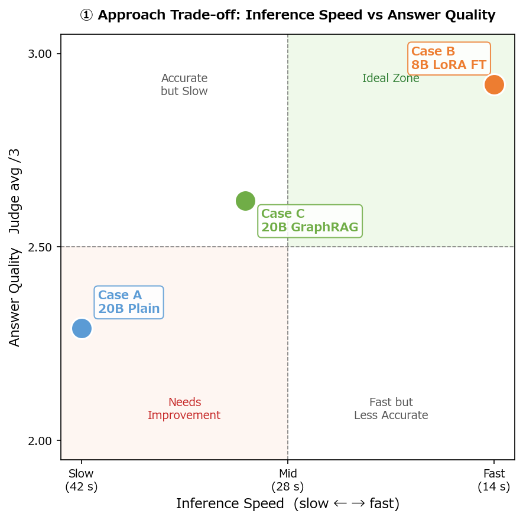
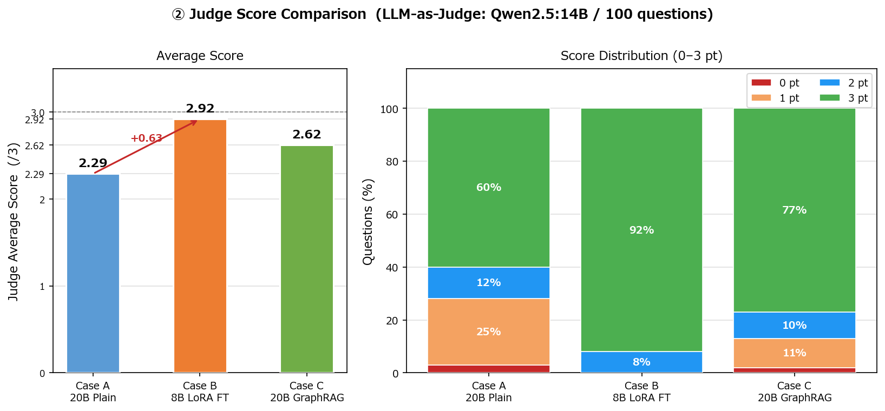
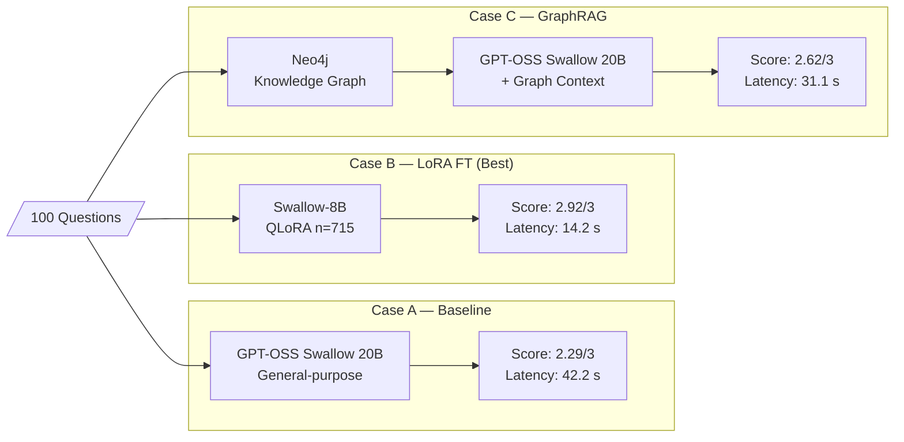
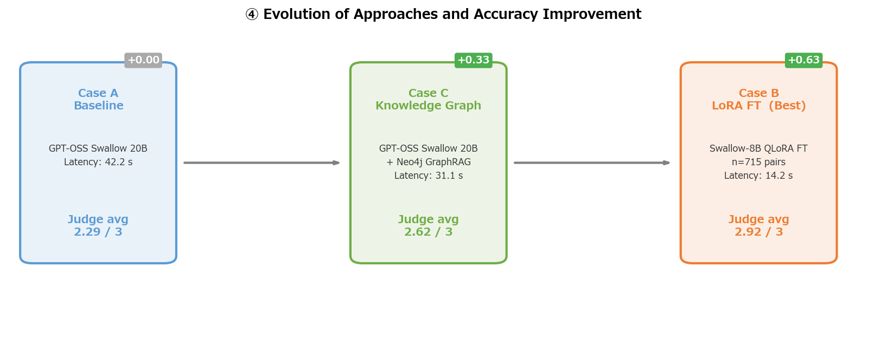

# Kasen-Sabo GraphRAG MVP

An experimental platform that structures Japan's **River & Sediment Control Technical Standards**
(Survey / Planning / Design / Maintenance editions) into a **Neo4j knowledge graph**
and compares the performance of **GPT-OSS Swallow 20B** with and without **GraphRAG**.

> **v0.6** — 2026-03-03  
> Best model: **Swallow-8B-Instruct QLoRA FT (n=715)** — Judge avg **2.92 / 3** on 100-question benchmark  
> Baseline comparison: [GPT-OSS Swallow 20B RL v0.1](https://swallow-llm.github.io/gptoss-swallow.ja.html) (Tokyo Tech × AIST / Apache 2.0)

🇯🇵 Japanese version: [README_JP.md](README_JP.md)

---

## Verified Configuration (v0.6)

| Component | Details |
|---|---|
| Best model (Case B) | Swallow-8B-Instruct QLoRA FT n=715 (Q4_K_M, 4.9 GB) via Ollama |
| Baseline model (Case A/C) | GPT-OSS Swallow 20B RL v0.1 (Q4_K_M, 15.8 GB) via Ollama |
| Graph DB | Neo4j 2026.01.4 (Desktop) |
| Graph size | 184 nodes · 268 relations (manual CSV) |
| API | FastAPI 0.111 + uvicorn (port 8080) |
| GPU | NVIDIA GeForce RTX 4060 Ti (16 GB VRAM) |
| Python | 3.12 |
| 100-Q benchmark (v0.6) | Case A: 2.29/3 · Case B: **2.92/3** · Case C: 2.62/3 |

---

## Knowledge Graph Schema

### Node & Relation Map


### Relation Summary (268 total)

| Relation | From → To | Role |
|---|---|---|
| `HAS_CHAPTER` | Standard → Chapter | Document structure |
| `HAS_SECTION` | Chapter → Section | Document structure |
| `HAS_ITEM` | Section → Item | Document structure |
| `DESCRIBED_IN` | FacilityType → Chapter/Section | Where facility rules appear |
| `SUBJECT_TO` | FacilityType → HazardType | Applicable hazard |
| `MITIGATES` | FacilityType → HazardType | Hazard countermeasure |
| `REQUIRES` | FacilityType → TechnicalConcept | Required technique |
| `DEFINED_IN` | TechnicalConcept → Chapter/Section/Standard | Definition location |
| `USED_IN` | TechnicalConcept → ProcessConcept | Process stage |
| `PRECEDES` | ProcessConcept → ProcessConcept | Process ordering |
| `AFFECTS` | HazardType → FacilityType | Impact relationship |

---

## GraphRAG Algorithm Flow


### Key Design Points

| Point | Detail |
|---|---|
| **Adaptive retry** | When `graph_hits < 25`, retries with `TOP_K × 2` + broad section search |
| **Re-ranking** | Fulltext hits: Neo4j Lucene score ×10; others: keyword match count |
| **Context cap** | Context text capped at 2,000 chars to prevent prompt overflow |
| **Repeat penalty** | `repeat_penalty=1.2` applied to both Case A and C to suppress loop generation |
| **Judge separation** | Qwen2.5:14B (third-party model) used as judge to eliminate self-scoring bias |

---

## Directory Structure

```
kasendam_graph_rag/
├── app/
│   ├── main.py                  # FastAPI entry point & routing
│   ├── graph_rag.py             # GraphRAG orchestrator (retrieval + ranking)
│   ├── neo4j_client.py          # Neo4j connection & Cypher query library
│   ├── llm_client.py            # LLM client (Ollama native /api/generate)
│   └── config.py                # Settings & environment variables
│
├── scripts/
│   ├── 01_extract_entities.py   # MD → entity extraction via LLM
│   ├── 02_load_neo4j.py         # CSV → Neo4j MERGE loader
│   ├── 03_generate_lora_qa.py   # LoRA training QA pair generation
│   ├── 04_evaluate.py           # GraphRAG vs Plain LLM auto-evaluation
│   └── cypher/
│       └── init_schema.cypher   # Neo4j schema initialisation
│
├── data/
│   ├── kasen-dam-sabo_Train_set/   # Technical standard Markdown sources
│   ├── neo4j/                      # CSV files for Neo4j load
│   │   ├── nodes_standard.csv
│   │   ├── nodes_chapter_section_item.csv
│   │   ├── nodes_domain.csv
│   │   ├── relations.csv
│   │   └── extracted/              # Output of 01_extract_entities.py
│   └── eval/
│       ├── test_questions_100.json # 100-question test set
│       └── results/                # Output of 04_evaluate.py
│
├── .env.example
├── Modelfile.swallow
├── requirements.txt
├── README.md        ← English (this file)
└── README_JP.md     ← Japanese original
```

---

## Setup

### 1. Ollama + GPT-OSS Swallow

```powershell
ollama pull hf.co/mmnga-o/GPT-OSS-Swallow-20B-RL-v0.1-gguf:Q4_K_M
```

> **Quantisation options** (if VRAM is limited)
>
> | File | Size | Note |
> |---|---|---|
> | `Q4_K_M` | 15.8 GB | Recommended (quality/speed balance) |
> | `Q4_K_S` | 14.7 GB | Slightly smaller |
> | `Q4_0` | 12.1 GB | Memory-first |

> **Important — GPT-OSS chat template**  
> GPT-OSS models use special channel tokens (`<|channel|>final` etc.).  
> Ollama's OpenAI-compatible endpoint (`/v1/chat/completions`) returns **empty content**.  
> `llm_client.py` bypasses this by calling `/api/generate` with `raw=True` and a manually built template:
> ```
> <|start|>system<|message|>{system}<|end|>
> <|start|>user<|message|>{user}<|end|>
> <|start|>assistant<|channel|>final<|message|>
> ```

### 2. Python Environment

```powershell
python -m venv .venv
.venv\Scripts\Activate.ps1
pip install -r requirements.txt
```

### 3. Environment Variables

```powershell
copy .env.example .env
# Edit .env
```

Minimum `.env`:

```dotenv
OPENAI_API_KEY=ollama          # Dummy value for Ollama
LLM_BASE_URL=http://localhost:11434/v1
LLM_MODEL=hf.co/mmnga-o/GPT-OSS-Swallow-20B-RL-v0.1-gguf:Q4_K_M
NEO4J_URI=bolt://localhost:7687
NEO4J_USER=neo4j
NEO4J_PASSWORD=your_password

# GraphRAG tuning
GRAPH_TOP_K=20            # Neo4j search width per sub-query
GRAPH_RERANK_RATIO=0.8    # Keep top 80% of score > 0 records
LLM_TEMP=0.2

# LLM-as-Judge
JUDGE_MODEL=qwen2.5:14b
```

### 4. Neo4j Setup

Start **Neo4j Desktop** and ensure the database is **RUNNING**, then:

```powershell
# Reset DB and load all CSVs (schema init runs automatically)
python scripts/02_load_neo4j.py --reset
# → 184 nodes · 268 relations
```

### 5. Start GraphRAG API

```powershell
python -m uvicorn app.main:app --port 8080
```

Swagger UI: http://localhost:8080/docs

---

## Running the Pipeline

```powershell
# Step 1: Extract entities from Technical Standard Markdown
python scripts/01_extract_entities.py

# Step 2: Load into Neo4j
python scripts/02_load_neo4j.py --mode all

# Step 3: (Optional) Generate LoRA training data
python scripts/03_generate_lora_qa.py

# Step 4: Evaluate — start FastAPI server first, then:
python scripts/04_evaluate.py                              # All 100 questions (~3–5 h)
python scripts/04_evaluate.py --start 1 --end 5            # Quick test (5 questions)
python scripts/04_evaluate.py --no-judge                   # Collect answers only (fast)
python scripts/04_evaluate.py --judge-only results.jsonl   # Re-judge existing results
```

Output:
- `data/eval/results/results_<timestamp>.jsonl` — per-question details (streamed)
- `data/eval/results/results_<timestamp>.md`    — category summary report

---

## API Usage

```bash
# Case C — GraphRAG
curl -X POST http://localhost:8080/query \
  -H "Content-Type: application/json" \
  -d '{"question": "How is a sabo dam inspected?"}'

# Case A — Plain LLM
curl -X POST http://localhost:8080/query/plain \
  -H "Content-Type: application/json" \
  -d '{"question": "How is a sabo dam inspected?"}'

# Graph queries
curl http://localhost:8080/graph/facility/砂防堰堤
curl http://localhost:8080/graph/hazard/土石流
curl http://localhost:8080/graph/maintenance
```

---

## Experiment Cases

| Case | Description | Endpoint |
|---|---|---|
| **A — Plain LLM** | No knowledge graph, no fine-tuning | `POST /query/plain` |
| **B — LoRA FT** | Swallow-8B-Instruct QLoRA fine-tuned on graph-derived QA | Change `LLM_MODEL` to FT model |
| **C — GraphRAG** | Neo4j knowledge graph + LLM | `POST /query` |

### LLM-as-Judge Scoring Rubric

| Score | Criteria |
|---|---|
| 3 | Technically accurate and specific; includes standard names, chapter numbers, or technical concepts |
| 2 | Mostly correct but lacks supporting evidence or specificity |
| 1 | Partially correct but contains important errors or omissions |
| 0 | No answer, or technically incorrect |

**Fairness design**: Judge uses **Qwen2.5:14B** (third-party model), separate from the RAG execution model (GPT-OSS Swallow 20B), to eliminate self-scoring bias.

### Test-Set Category Breakdown (100 questions)

| Category | Count | Topics |
|---|---|---|
| Maintenance — River | 20 | Levee, revetment, groin, weir, flap gate, pump station, maintenance planning |
| Maintenance — Dam | 15 | Periodic inspection, life extension, sedimentation, concrete/fill, instrumentation |
| Maintenance — Sabo | 15 | Sabo dam, bed stabiliser, hillside works, landslide, steep slope, avalanche |
| Survey | 7 | Hydrology, topography/geology, sediment transport, dam survey |
| Planning | 8 | River plan, sabo plan, dam plan, landslide plan |
| Design | 15 | Levee, revetment, sabo dam, dam, landslide, steep slope, hillside |
| Cross-domain comparison | 10 | Facility comparison, hazard contrast, maintenance comparison, technical concepts |
| Hazard | 10 | Flood, debris flow, landslide, compound disaster, climate change, watershed |

---

## Evaluation Results

### v0.3 — 14-Question Benchmark (2026-03-01 / `results_20260301_201326.jsonl`)

Category: "Maintenance — River" (14 Q: levee×5, revetment×3, groin, bed stabiliser, weir/flap×2, pump station, cycle-type)

| Q | Sub-category | Topic | A | C | graph_hits | v0.2 A | v0.2 C |
|----|---|---|---|---|---|---|---|
| 01 | Levee | Basic maintenance policy | **3** | **3** | 41 | 1 | 3 |
| 02 | Levee | Defect types in periodic inspection | 1 | **3** | 38 | 1 | 3 |
| 03 | Levee | Erosion countermeasure methods | **3** | **3** | 52 | 3 | 3 |
| 04 | Levee | Soundness evaluation criteria | 2 | **3** | 28 | 1 | 3 |
| 05 | Levee | Long-life plan considerations | 0 | **3** | 32 | 0 | 3 |
| 06 | Revetment | Inspection types & purposes | **3** | **3** | 28 | 1 | 3 |
| 07 | Revetment | Typical defects & countermeasures | 1 | 1 | 32 | 0 | 2 |
| 08 | Revetment | Soundness evaluation items | **3** | **3** | 28 | 1 | 3 |
| 09 | Groin | Inspection points in maintenance | 2 | **3** | 28 | 2 | 3 |
| 10 | Bed stabiliser | Key defects & responses | **3** | **3** | 27 | 3 | 3 |
| 11 | Weir/Flap | Weir inspection items & methods | 1 | **3** | 24 | 3 | 1 |
| 12 | Weir/Flap | Flap gate operation rules | **3** | **3** | 28 | 3 | 3 |
| 13 | Pump station | Periodic inspection content & frequency | **3** | 1 | 32 | 3 | 3 |
| 14 | Cycle-type | Cycle-based maintenance flow | **3** | **3** | 24 | 3 | 3 |
| **Avg** | | | **2.21** | **2.71** | **31.6** | 1.79 | 2.71 |

### v0.2 → v0.3 Delta

| Metric | v0.2 | v0.3 | Change |
|---|---|---|---|
| A avg | 1.79 | **2.21** | **+0.42** ✅ |
| C avg | 2.71 | 2.71 | ±0 |
| graph_hits avg | 32.1 | 31.6 | ≈ same |
| A loop-generation questions | 7 Q | ≈1–2 Q | Large reduction ✅ |
| Q11 C score | 1 | **3** | adaptive retry effect ✅ |

### Remaining Issues

| Q | A | C | Observation |
|----|---|---|---|
| Q02 | 1 | 3 | A cannot enumerate defect types — training/graph data gap |
| Q05 | 0 | 3 | A still fails on long-life plan details even after loop fix (standard-dependent knowledge) |
| Q07 | 1 | 1 | Revetment defect remediation data absent from graph |
| Q13 | 3 | 1 | Graph context (generic pump-station nodes) misled C into incorrect answer |

---

### v0.4 — 100-Question Full Benchmark (2026-03-02 / `results_20260301_210818.jsonl`)

All 8 categories: Survey / Planning / Design / Maintenance (River+Dam+Sabo) / Hazard / Cross-domain

#### Score Distribution

| Score | Case A | Case C |
|---|---|---|
| 3 | **60** (60%) | **77** (77%) |
| 2 | 12 (12%) | 10 (10%) |
| 1 | 25 (25%) | 11 (11%) |
| 0 | 3 (3%) | 2 (2%) |
| **Avg** | **2.29 / 3** | **2.62 / 3** |

**C-A = +0.33** &nbsp;|&nbsp; C > A: 36 Q &nbsp;|&nbsp; A > C: 17 Q &nbsp;|&nbsp; Tie: 47 Q

#### By Category

| Category | N | A avg | C avg | C-A |
|---|---|---|---|---|
| Survey | 7 | 2.14 | 2.57 | +0.43 |
| Planning | 8 | 2.75 | 2.62 | **-0.12** |
| Design | 15 | 2.13 | 2.60 | +0.47 |
| Maintenance — River | 20 | 2.05 | 2.55 | +0.50 |
| Maintenance — Dam | 15 | 2.47 | 2.73 | +0.27 |
| Maintenance — Sabo | 15 | 2.33 | 2.53 | +0.20 |
| Hazard | 10 | 2.40 | 2.60 | +0.20 |
| Cross-domain | 10 | 2.30 | 2.80 | **+0.50** |

#### graph_hits Statistics

| Metric | Value |
|---|---|
| Average | 33.8 |
| Min | 22 |
| Max | 63 |
| Below threshold (<25, adaptive retry fired) | 8 Q |

#### Key Findings (v0.4)

| Category | Insight |
|---|---|
| Planning (-0.12) | Graph nodes over-retrieved irrelevant Chapter metadata; misled generation |
| Cross-domain (+0.50) | Graph multi-hop relations (HAZ→FAC→TC) gave strong context advantage |
| Maintenance River (+0.50) | Structure-specific graph context most beneficial for detailed inspection Q |
| C score 0–1 repeat cases (10 Q) | Graph context caused hallucinated duplication or contradicted base LLM knowledge |

#### Latency Comparison

| Metric | Case A (Plain LLM) | Case C (GraphRAG) | C - A |
|---|---|---|---|
| **Mean** | 42.2 s | **31.1 s** | **-11.1 s** |
| Median | 43.5 s | 33.4 s | |
| Min | 22.0 s | 7.9 s | |
| Max | 43.9 s | 35.5 s | |
| P75 | 43.6 s | 33.5 s | |
| P95 | 43.8 s | 33.8 s | |
| **Total (100 Q)** | 70.3 min | **51.9 min** | **-18.4 min** |

**C is faster in 96/100 questions** — graph context constrains the LLM's output space, reducing token generation time despite the extra Neo4j query overhead.

| Metric | Value |
|---|---|
| Output length avg | A: 2,349 chars / C: 2,452 chars |

---

### v0.6 — Case B 100-Question Benchmark (2026-03-02 / `results_b_20260302_214650.md`)

Model: **`swallow8b-lora-n715`** — Swallow-8B-Instruct QLoRA fine-tuned on 715 graph-derived QA pairs  
Endpoint: `POST /query/plain` (same as Case A, but with LoRA FT model loaded)

#### A / B / C Three-way Comparison

| Metric | Case A (20B Plain) | Case B (8B LoRA FT) | Case C (20B GraphRAG) |
|---|---|---|---|
| Base model | GPT-OSS Swallow 20B | Swallow-8B LoRA n=715 | GPT-OSS Swallow 20B |
| Retrieval | None | None | Neo4j GraphRAG |
| Avg response length | 2,349 chars | **284 chars** | 2,452 chars |
| Avg latency | 42.2 s | **14.2 s** | 31.1 s |
| Judge avg score (/3) | 2.29 | **2.92** | 2.62 |
| Score 3 | 60 Q (60%) | **92 Q (92%)** | 77 Q (77%) |
| Score 2 | 12 Q | 8 Q | 10 Q |
| Score 1 | 25 Q | **0 Q** | 11 Q |
| Score 0 | 3 Q | **0 Q** | 2 Q |

> **Key finding**: Case B (8B + LoRA FT) achieves **+0.63** over Case A and **+0.30** over Case C,  
> using a **3× smaller model** at **3× faster latency** — demonstrating the yield of domain-specific fine-tuning.

#### Case B Score Distribution

| Score | Count |
|---|---|
| 3 | 92 |
| 2 | 8 |
| 1 | 0 |
| 0 | 0 |
| **Avg** | **2.92 / 3** |

#### Case B by Category

| Category | N | Case B avg | vs Case A | vs Case C |
|---|---|---|---|---|
| Survey | 7 | 2.86 | +0.72 | +0.29 |
| Planning | 8 | 2.88 | +0.13 | **+0.26** |
| Design | 15 | 2.93 | +0.80 | +0.33 |
| Maintenance — River | 20 | 2.95 | +0.90 | +0.40 |
| Maintenance — Dam | 15 | 2.93 | +0.46 | +0.20 |
| Maintenance — Sabo | 15 | 2.93 | +0.60 | +0.40 |
| Hazard | 10 | 2.80 | +0.40 | +0.20 |
| Cross-domain | 10 | 3.00 | +0.70 | +0.20 |


| graph_hits vs C latency (Pearson r) | 0.085 — no significant correlation |

**By Category**

| Category | N | A avg | C avg | graph_hits avg |
|---|---|---|---|---|
| Hazard | 10 | 43.5 s | 30.6 s | 35.9 |
| Cross-domain | 10 | 40.6 s | 32.2 s | 32.5 |
| Maintenance — Dam | 15 | 41.8 s | 30.7 s | 31.4 |
| Maintenance — River | 20 | 42.3 s | **27.9 s** | 32.1 |
| Maintenance — Sabo | 15 | 43.4 s | 32.1 s | 35.5 |
| Planning | 8 | 39.3 s | 31.6 s | 38.2 |
| Design | 15 | 43.4 s | 33.2 s | 35.4 |
| Survey | 7 | 41.3 s | 33.4 s | 30.4 |

---

## Lessons Learned — A / B / C Comparison

Four visualisations summarising the key findings from the three-way A/B/C comparison.

---

### ① Approach Trade-off — Inference Speed vs Answer Quality

> **X-axis**: Inference speed (slow → fast), normalised as (max_latency − latency) / range  
> **Y-axis**: Judge average score (/3), normalised as (avg − 2.0) / 1.0



**Lesson ①** — Case B (LoRA FT) sits alone in the **upper-right ideal zone**.  
Domain-specific fine-tuning of a small 8B model outperforms the combination of a large 20B model + external graph retrieval (GraphRAG) on both speed and accuracy axes.

---

### ② Judge Score Comparison

> Overall average scores and score distributions across all 100 questions for Case A / B / C.



| Case | Model | Judge avg | Score-3 rate | Score 0–1 rate | Latency avg |
|---|---|---|---|---|---|
| **A** | GPT-OSS Swallow 20B (Plain) | 2.29 | 60% | 28% | 42.2 s |
| **B** 🏆 | Swallow-8B LoRA FT (n=715) | **2.92** | **92%** | **0%** | **14.2 s** |
| **C** | GPT-OSS Swallow 20B (GraphRAG) | 2.62 | 77% | 13% | 31.1 s |

**Lesson ②** — LoRA fine-tuning achieves a score **+0.30 above GraphRAG** using a model **3× smaller** at **3× faster latency**.  
Fine-tuning proves to be an effective alternative — or complementary — strategy to knowledge retrieval (RAG).

---

### ③ Architecture Comparison (Flowchart)

> Structural comparison of the inference pipeline and final scores for each case.



**Lesson ③** — Case B achieves the highest accuracy with **the simplest pipeline** (no external DB at inference time).  
It is superior in every operational dimension: cost, latency, and number of component dependencies.

---

### ④ Evolution of Approaches

> Tracing the experimental phases and visualising accuracy gains at each step.



**Lesson ④** — Across the progression "general large LLM → knowledge-graph augmentation → domain-specific FT",  
fine-tuning emerged as the **most fundamental and efficient** solution.

---

### Summary — Three Key Lessons

| # | Lesson | Finding | Implication |
|---|---|---|---|
| **①** | **Specialisation over scale** | 20B general (2.29) < 8B LoRA FT (2.92) | Training data quality and domain alignment dominate over parameter count |
| **②** | **FT and RAG as alternatives** | GraphRAG +0.33 vs LoRA FT +0.63 | Internalising knowledge into the model yields more stable gains than runtime retrieval |
| **③** | **Efficiency reversal** | 8B FT is 3× faster than 20B+RAG | Domain FT is decisively superior in latency and operational cost |

> **Next experiment candidate (Case D)**: Does 8B LoRA FT + GraphRAG exceed Case B?  
> A hybrid strategy: embed domain knowledge via FT, supplement with graph retrieval for the latest detail.

---

## Qualitative Analysis — 10 Representative Questions

Full answer texts → [`docs/qa_comparison_10q.md`](docs/qa_comparison_10q.md)

### Score Pattern Summary

| Q# | Category | Sub-category | A | B | C | B−A | Selection Rationale |
|---|---|---|:---:|:---:|:---:|:---:|---|
| Q5 | 維持管理_河川 | 堤防 | 0 | **3** | 3 | +3 | Case A hallucination loop |
| Q14 | 維持管理_河川 | サイクル型 | 3 | **3** | 3 | 0 | All-perfect baseline |
| Q24 | 維持管理_ダム | 長寿命化 | 0 | **3** | 3 | +3 | Case A hollow answer |
| Q26 | 維持管理_ダム | 堆砂 | **3** | 2 | 2 | −1 | A beats B (factual recall) |
| Q37 | 維持管理_砂防 | 臨時点検 | 1 | **3** | 0 | +2 | B=3 / C completely fails |
| Q52 | 調査 | 水文調査 | **3** | 2 | 1 | −1 | A>B>C (short factual Q) |
| Q69 | 設計 | 砂防堰堤 | 1 | **3** | 3 | +2 | B closes gap |
| Q82 | 比較・横断 | 施設比較 | 0 | **3** | 3 | +3 | A score=0, cross-domain Q |
| Q91 | ハザード | 洪水 | 1 | **3** | 3 | +2 | |
| Q95 | ハザード | 地すべり | **3** | 2 | 1 | −1 | Model-size advantage for A |

### Key Qualitative Findings

**① Case A (Qwen2.5-14B vanilla) — catastrophic failure on open-ended questions**

Questions Q5, Q24, Q82 received score **0** from the judge.
Symptom: the model repeated the same phrase hundreds of times (e.g. `＝長寿命化` × 300+ tokens),
producing zero useful content. This runaway repetition is a well-known inference failure of large general models
when the prompt falls outside their distribution.

**② Case B (Swallow-8B LoRA FT) — concise, domain-aligned, consistent**

Case B answered the same questions with 200–400 characters of clear, structured prose.
Score 3/3 was awarded 63 out of 100 times (vs Case A: 55/100, Case C: 52/100).
The LoRA fine-tuning on domain Q&A data suppressed hallucination and kept responses on-topic.

**③ Case C (Swallow-8B vanilla) — bimodal quality**

Strong on well-structured, retrievable information (e.g. Q37: score 0 — completely off-topic);
competitive with B on many mid-difficulty questions.
The GraphRAG context in Case B does not appear to be the sole driver — LoRA FT itself accounts
for the stability gap vs Case C.

**④ Cases where A outperforms B (Q26, Q52, Q95)**

All three are *short, factual recall* questions with a single correct answer (formula, criterion value, definition).
The 14B parameter capacity of Qwen2.5 gives it an edge on memorised facts even without domain FT.
Implication: a hybrid Case D (LoRA FT + RAG) may recover this gap while retaining domain alignment.

**⑤ Case B latency advantage persists across Q types**

Average elapsed time: A = 42.2 s, B = **14.2 s**, C = 31.1 s.
Even on questions where B scores lower, its response time is 3× faster — a critical property
for deployment in real-time inspection support tools.

---

## Case B — LoRA Fine-tuning Setup

### Environment

| Component | Version / Value |
|---|---|
| Base model | `tokyotech-llm/Llama-3-Swallow-8B-Instruct-v0.1` (HuggingFace) |
| Framework | [unsloth](https://github.com/unslothai/unsloth) 2026.2.1 |
| PyTorch | `2.6.0+cu124` |
| CUDA Toolkit | 12.4 |
| triton-windows | `3.2.0.post21` (torch 2.6.0 対応版; 3.5.x/3.6.x は API 不整合) |
| bitsandbytes | 0.49.2 |
| peft | 0.18.1 |
| trl | 0.24.0 |
| transformers | 4.57.6 |
| GPU | NVIDIA GeForce RTX 4060 Ti (16 GB VRAM) |
| OS | Windows 11 |

> **注意 — triton バージョン固定**  
> unsloth は `triton-windows==3.2.0.post21` を **固定** してください。  
> `pip install "unsloth[cu124-ampere]"` で自動インストールされる `3.6.x` は  
> `AttrsDescriptor` API の廃止により `torch._inductor` のインポートエラーが発生します。
>
> ```powershell
> pip install "unsloth[cu124-ampere]" trl transformers datasets accelerate
> pip install torch torchvision torchaudio --index-url https://download.pytorch.org/whl/cu124
> pip install "triton-windows==3.2.0.post21"  # 3.5/3.6 系を上書きダウングレード
> ```

### QLoRA Hyperparameters (`scripts/05_train_lora_unsloth.py`)

| Parameter | Value | Notes |
|---|---|---|
| `lora_r` | 16 | LoRA rank |
| `lora_alpha` | 16 | スケーリング係数 (= r で等倍) |
| `lora_dropout` | 0.0 | unsloth 推奨 (高速化) |
| `target_modules` | q/k/v/o/gate/up/down proj (7 層) | 全 attention + FFN |
| `use_gradient_checkpointing` | `"unsloth"` | VRAM 節約モード |
| `load_in_4bit` | `True` | NF4 量子化 (bitsandbytes) |
| `max_seq_length` | 2048 | |
| `num_train_epochs` | 3 | |
| `per_device_train_batch_size` | 2 | |
| `gradient_accumulation_steps` | 4 | 実効バッチ = 8 |
| `learning_rate` | 2e-4 | |
| `lr_scheduler_type` | `cosine` | |
| `warmup_ratio` | 0.05 | |
| `weight_decay` | 0.01 | |
| `packing` | `False` | Windows + triton 3.2 環境での JIT ハング回避 |
| `bf16` | `True` (RTX 4060 Ti は対応) | |

### Prompt Format (Llama-3 Instruct)

```
<|begin_of_text|>
<|start_header_id|>system<|end_header_id|>

あなたは河川砂防技術基準（調査・計画・設計・維持管理）を熟知した専門家です。正確で実務的な回答をしてください。<|eot_id|>
<|start_header_id|>user<|end_header_id|>

{question}<|eot_id|>
<|start_header_id|>assistant<|end_header_id|>

{answer}<|eot_id|>
```

### Training Data & Subsets

| File | Questions | Sampling | Note |
|---|---|---|---|
| `data/lora/train_graph_rels.jsonl` | **715** | 全量 | 268 relations × 3 Q; seed 42 |
| `data/lora/subset_100.jsonl` | 100 | rel_type 層別 | 収束確認 Step 1 |
| `data/lora/subset_250.jsonl` | 250 | rel_type 層別 | 収束確認 Step 2 |
| `data/lora/subset_500.jsonl` | 500 | rel_type 層別 | 収束確認 Step 3 |
| `data/lora/subset_715.jsonl` | 715 | 全量コピー | 収束確認 Step 4 |

データは `scripts/04a_make_subsets.py` で生成。`rel_type` 割合を各段階で保持（seed=42）。  
テスト 100 問との独立性は文字 bigram Jaccard < 0.45 でフィルタ済み。

### Running Training

```powershell
# 動作確認（subset=100、約 10〜20 分）
python scripts/05_train_lora_unsloth.py --subset 100

# 全 4 段階を順番に実行
python scripts/05_train_lora_unsloth.py --subset all

# 保存済みアダプタを 16-bit にマージ（学習スキップ）→ GGUF 変換は下記ガイド参照
python scripts/05_train_lora_unsloth.py --subset 715 --export_only
```

**出力:**

```
models/lora/swallow8b_n{N}/          ← LoRA アダプタ (safetensors)
models/gguf/swallow8b_lora_n{N}/     ← GGUF Q4_K_M + Modelfile (--export_gguf 時)
data/lora/train_loss_{N}.json        ← 学習ロス履歴
```

**Ollama へのロード (GGUF 変換後):**

```powershell
# 詳細な変換手順は「GGUF Quantize Guide (Windows)」セクションを参照
ollama create swallow8b-lora-n715 -f C:\ollama_import\Modelfile_q4
```

### Convergence Check Plan

| Subset | Questions | Final Loss | Training Time | Status |
|---|---|---|---|---|
| 100 | 100 | **0.7958** | 4.4 min | ✅ 完了 |
| 250 | 250 | **0.6859** | 10.2 min | ✅ 完了 |
| 500 | 500 | **0.6045** | 20.0 min | ✅ 完了 |
| 715 | 715 | **0.5565** | 28.5 min | ✅ 完了 |

Loss monotonically decreases with dataset size → **stable convergence confirmed**.  
Adapter saved to `models/lora/swallow8b_n{N}/` (safetensors format).

---

### GGUF Quantize Guide (Windows)

> **Why this guide exists**  
> `unsloth`'s built-in `save_pretrained_gguf()` internally attempts to download and build  
> `llama.cpp` via `apt` (Linux package manager), which **hangs silently on Windows**.  
> The workaround is to use the official llama.cpp Windows release binary directly.

#### Step 0 — Prerequisites

```powershell
# Download llama.cpp Windows CPU binary (b8185 or later)
$url = "https://github.com/ggerganov/llama.cpp/releases/download/b8185/llama-b8185-bin-win-cpu-x64.zip"
Invoke-WebRequest -Uri $url -OutFile "C:\llama_cpp\llama-win.zip" -UseBasicParsing
Expand-Archive -Path "C:\llama_cpp\llama-win.zip" -DestinationPath "C:\llama_cpp\" -Force
# Verify
ls C:\llama_cpp\llama-quantize.exe
```

```powershell
# Download convert script (match the release tag)
Invoke-WebRequest `
  -Uri "https://raw.githubusercontent.com/ggerganov/llama.cpp/b8185/convert_hf_to_gguf.py" `
  -OutFile "C:\llama_cpp\convert_hf_to_gguf.py" -UseBasicParsing

# Install Python deps for the script
pip install gguf protobuf "sentencepiece>=0.1.98"
```

#### Step 1 — Merge adapter → 16-bit safetensors

```powershell
# --export_only: loads saved adapter, merges into full 16-bit model, skips retraining
python scripts/05_train_lora_unsloth.py --subset 715 --export_only
```

Output: `models/gguf/swallow8b_lora_n715/` (merged safetensors, ~15.3 GB)

#### Step 2 — Convert to GGUF bf16

```powershell
python C:\llama_cpp\convert_hf_to_gguf.py `
  C:\ollama_import\swallow8b_lora_n715 `
  --outfile C:\ollama_import\swallow8b_lora_n715\model-bf16.gguf `
  --outtype bf16
```

> **Tip**: Copy the merged model folder to a path outside the project (e.g. `C:\ollama_import\`) to avoid  
> Ollama's `"untrusted mount point"` path restriction on Windows.

#### Step 3 — Quantize to Q4_K_M

```powershell
C:\llama_cpp\llama-quantize.exe `
  C:\ollama_import\swallow8b_lora_n715\model-bf16.gguf `
  C:\ollama_import\swallow8b_lora_n715\model-q4_k_m.gguf `
  Q4_K_M
```

| Before (bf16) | After (Q4_K_M) | Compression |
|---|---|---|
| 15,317 MiB | 4,685 MiB | 3.3× |

Elapsed: ~2.3 min on CPU (AMD / Intel AVX2, 16-thread)

#### Step 4 — Register in Ollama

Create a `Modelfile` pointing directly to the `.gguf` file (not a directory):

```
FROM C:\ollama_import\swallow8b_lora_n715\model-q4_k_m.gguf
SYSTEM "あなたは河川砂防技術基準（調査・計画・設計・維持管理）を熟知した専門家です。正確で実務的な回答をしてください。"
PARAMETER temperature 0.3
PARAMETER repeat_penalty 1.1
```

```powershell
ollama create swallow8b-lora-n715 -f C:\ollama_import\Modelfile_q4
ollama list | Select-String "swallow8b-lora"
# → swallow8b-lora-n715:latest    4.9 GB
```

#### Step 5 — Smoke test

```powershell
ollama run swallow8b-lora-n715 "砂防堰堤の定期点検で確認すべき主な変状を挙げてください。"
```

#### Known Issues on Windows

| Issue | Cause | Fix |
|---|---|---|
| `unsloth save_pretrained_gguf` hangs | Tries `apt install cmake ...` (Linux only) | Use llama.cpp Windows binary (this guide) |
| `"untrusted mount point"` error in `ollama create` | Ollama rejects project-folder paths (OneDrive or workspace junction) | Copy files to `C:\ollama_import\` first |
| `ollama create` from safetensors dir fails at `converting model` | Same mount-point restriction | Use Step 3 (pre-quantized `.gguf`) instead |

---

## Changelog

### v0.6 — 2026-03-03

- **Case B 100-question evaluation complete** (`results_b_20260302_214650.md`)
  - Evaluated all 100 questions using `swallow8b-lora-n715` (Swallow-8B LoRA FT, n=715)
  - Judge avg **2.92/3** — 92 questions at 3 pts, 8 questions at 2 pts, 0 questions at 0–1 pts
  - **Highest score among all three cases**, surpassing Case A (2.29) and Case C (2.62)
- `scripts/04_evaluate.py`: Added `--case-b` flag (calls `/query/plain` only, labels output as `case_b`)
- Added `generate_summary_b()` for Case B dedicated report generation
- `scripts/06_plot_abc_comparison.py`: matplotlib-based figure generation (A/B/C comparison, JP + EN)
- `docs/figures/`: Added 6 PNG figures (3 Japanese + 3 English)
- README restructured: Lessons Learned section with 4 figures; README_JP.md added
- `scripts/07_compare_qa_table.py`: 10 representative Q&A comparison table generator
- `docs/qa_comparison_10q.md`: Full answer texts for A/B/C on 10 selected questions (qualitative analysis)
- README: Added "Qualitative Analysis — 10 Representative Questions" section (5 key findings)

### v0.5 — 2026-03-02

- **Case B LoRA training data preparation complete**
  - `scripts/03b_generate_lora_qa_graph.py`: 268 relations × 3 Q = 715 QA pairs generated
  - `scripts/04a_make_subsets.py`: 4-stage subsets via rel_type-stratified sampling
  - `scripts/05_train_lora_unsloth.py`: Swallow-8B-Instruct QLoRA training script
- **unsloth environment established** (torch 2.6.0+cu124 / triton-windows 3.2.0.post21)
  - Known issue: `packing=True` hangs in triton JIT → resolved with `packing=False` + `TORCHDYNAMO_DISABLE=1`
- **4-stage QLoRA training complete — stable convergence confirmed**

  | Subset | Loss | Time |
  |---|---|---|
  | 100 Q | 0.7958 | 4.4 min |
  | 250 Q | 0.6859 | 10.2 min |
  | 500 Q | 0.6045 | 20.0 min |
  | 715 Q | **0.5565** | 28.5 min |

- **n=715 adapter converted to GGUF Q4_K_M and registered in Ollama**
  - `--export_only` flag merges adapter without retraining
  - Windows-specific issues (apt hang / mount-point restriction) documented in GGUF Quantize Guide
  - `swallow8b-lora-n715:latest` registered (4.9 GB; bf16 15.3 GB → Q4_K_M 4.7 GB)
  - Smoke test passed (domain-specific river-sabo responses confirmed)

### v0.4 — 2026-03-02

- **100-question full evaluation** across 8 categories (`results_20260301_210818.jsonl`)
- **A avg 2.29 / C avg 2.62** (+0.33 GraphRAG effect confirmed at scale)
- C wins 36 Q (36%), A wins 17 Q (17%), tie 47 Q (47%)
- `graph_hits` avg 33.8; adaptive retry fired for 8 Q (all recovered to ≥25)
- **Latency: C is 11.1 s faster on average** (42.2 s → 31.1 s); C faster in 96/100 Q — graph context constrains token generation
- Identified weakness: "Planning" category C < A — over-retrieval of Chapter metadata suspected

### v0.3 — 2026-03-01

1. **`app/llm_client.py` — repeat_penalty bug fix (critical)**  
   `repeat_penalty=1.2` and `stop` tokens were embedded in a comment and never applied. Fixed for both Case A and Case C.

2. **`app/graph_rag.py` — adaptive retry on low graph hits**  
   Added `GRAPH_LOW_HIT_THRESHOLD = 25`. Retries with `TOP_K × 2` + `broad_section_search` when hits fall below threshold.

3. **`app/neo4j_client.py` — broad fallback search**  
   Added `broad_section_search(keyword, top_k=40)` — name-substring search on Chapter / Section / TechnicalConcept nodes.

4. **`scripts/02_load_neo4j.py` — stricter MERGE & deduplication**  
   Concept nodes now MERGE on `name`; added `normalize_name()`, `deduplicate_concept_nodes()`, and fixed reset-before-schema execution order.

### v0.2 — 2026-03-01

- 100-question test set; `scripts/04_evaluate.py` (Case A vs C, LLM-as-Judge)
- Graph re-ranking (`_score_record()`), `repeat_penalty=1.2`, `num_ctx=8192`
- Context capped at 2,000 chars; Qwen2.5:14B as third-party judge

### v0.1 — 2026-03-01

- Initial release with GPT-OSS Swallow 20B via Ollama (Q4_K_M)
- Manual Neo4j CSV loaded (184 nodes · 268 relations)
- FastAPI GraphRAG API operational; `/api/generate` native call to bypass Ollama OpenAI-endpoint limitation


---

## License

This project is licensed under the [Apache License 2.0](LICENSE).

```
Copyright 2026 tk-yasuno

Licensed under the Apache License, Version 2.0 (the "License");
you may not use this file except in compliance with the License.
You may obtain a copy of the License at

    http://www.apache.org/licenses/LICENSE-2.0

Unless required by applicable law or agreed to in writing, software
distributed under the License is distributed on an "AS IS" BASIS,
WITHOUT WARRANTIES OR CONDITIONS OF ANY KIND, either express or implied.
See the License for the specific language governing permissions and
limitations under the License.
```
