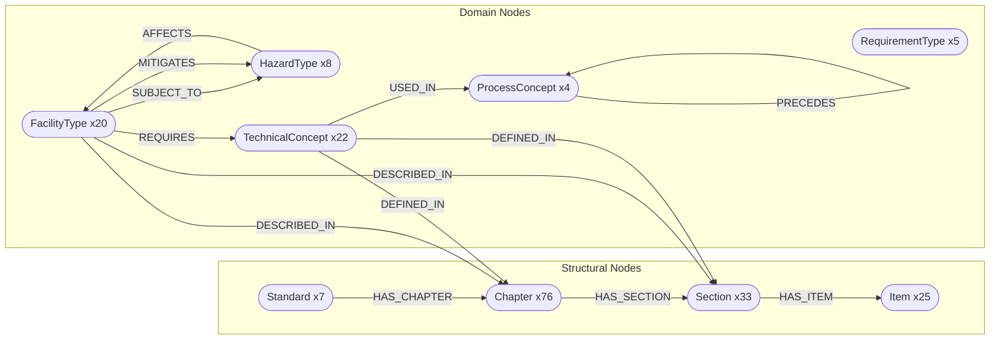
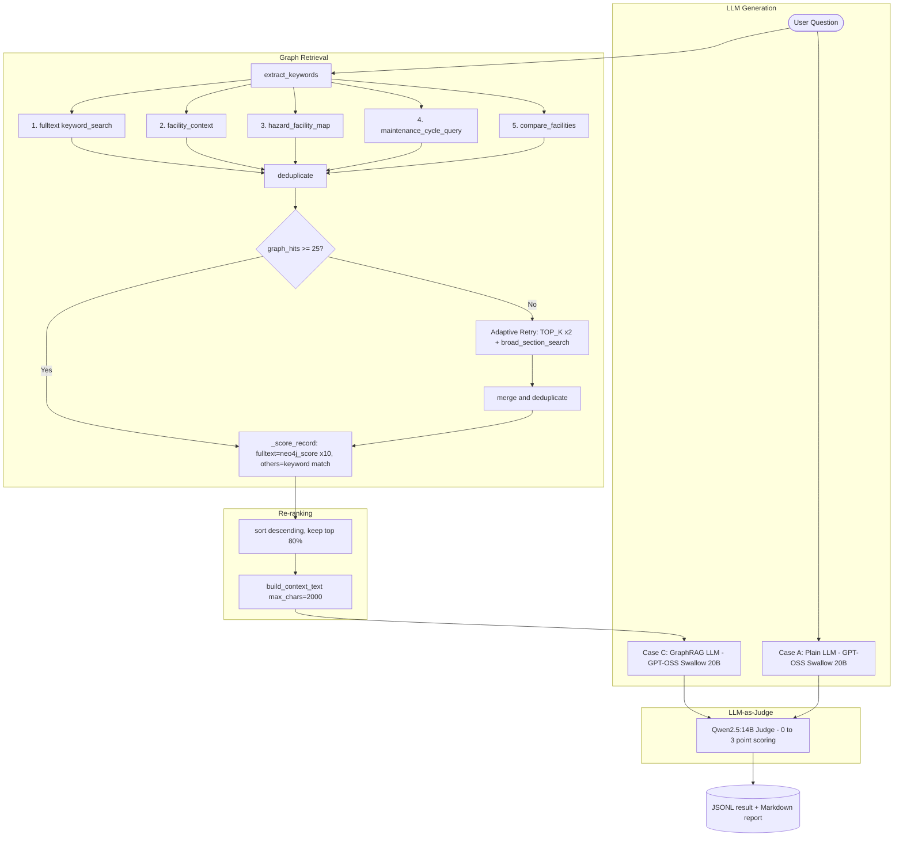

# Kasen-Sabo GraphRAG MVP

An experimental platform that structures Japan's **River & Sediment Control Technical Standards**
(Survey / Planning / Design / Maintenance editions) into a **Neo4j knowledge graph**
and compares the performance of **GPT-OSS Swallow 20B** with and without **GraphRAG**.

> **v0.3** — 2026-03-01  
> LLM backend: [GPT-OSS Swallow 20B RL v0.1](https://swallow-llm.github.io/gptoss-swallow.ja.html)  
> (Tokyo Tech × AIST — Japanese/reasoning-enhanced Apache 2.0 model built on GPT-OSS)

🇯🇵 Japanese version: [README_JP.md](README_JP.md)

---

## Verified Configuration (v0.3)

| Component | Details |
|---|---|
| LLM | GPT-OSS Swallow 20B RL v0.1 (Q4_K_M, 15.8 GB) via Ollama |
| Graph DB | Neo4j 2026.01.4 (Desktop) |
| Graph size | 184 nodes · 268 relations (manual CSV) |
| API | FastAPI 0.111 + uvicorn (port 8080) |
| Python | 3.12 |
| 14-Q score (v0.3) | Case A: **2.21/3** → Case C: **2.71/3** (+0.50) |

---

## Knowledge Graph Schema

### Node & Relation Map



### Relation Summary (268 total)

| Relation | From → To | Role |
|---|---|---|
| `HAS_CHAPTER` | Standard → Chapter | Document structure |
| `HAS_SECTION` | Chapter → Section | Document structure |
| `HAS_ITEM` | Section → Item | Document structure |
| `DESCRIBED_IN` | FacilityType → Chapter/Section | Where facility rules appear |
| `SUBJECT_TO` | FacilityType → HazardType | Applicable hazard |
| `MITIGATES` | FacilityType → HazardType | Hazard countermeasure |
| `REQUIRES` | FacilityType → TechnicalConcept | Required technique |
| `DEFINED_IN` | TechnicalConcept → Chapter/Section/Standard | Definition location |
| `USED_IN` | TechnicalConcept → ProcessConcept | Process stage |
| `PRECEDES` | ProcessConcept → ProcessConcept | Process ordering |
| `AFFECTS` | HazardType → FacilityType | Impact relationship |

---

## GraphRAG Algorithm Flow



### Key Design Points

| Point | Detail |
|---|---|
| **Adaptive retry** | When `graph_hits < 25`, retries with `TOP_K × 2` + broad section search |
| **Re-ranking** | Fulltext hits: Neo4j Lucene score ×10; others: keyword match count |
| **Context cap** | Context text capped at 2,000 chars to prevent prompt overflow |
| **Repeat penalty** | `repeat_penalty=1.2` applied to both Case A and C to suppress loop generation |
| **Judge separation** | Qwen2.5:14B (third-party model) used as judge to eliminate self-scoring bias |

---

## Directory Structure

```
kasendam_graph_rag/
├── app/
│   ├── main.py                  # FastAPI entry point & routing
│   ├── graph_rag.py             # GraphRAG orchestrator (retrieval + ranking)
│   ├── neo4j_client.py          # Neo4j connection & Cypher query library
│   ├── llm_client.py            # LLM client (Ollama native /api/generate)
│   └── config.py                # Settings & environment variables
│
├── scripts/
│   ├── 01_extract_entities.py   # MD → entity extraction via LLM
│   ├── 02_load_neo4j.py         # CSV → Neo4j MERGE loader
│   ├── 03_generate_lora_qa.py   # LoRA training QA pair generation
│   ├── 04_evaluate.py           # GraphRAG vs Plain LLM auto-evaluation
│   └── cypher/
│       └── init_schema.cypher   # Neo4j schema initialisation
│
├── data/
│   ├── kasen-dam-sabo_Train_set/   # Technical standard Markdown sources
│   ├── neo4j/                      # CSV files for Neo4j load
│   │   ├── nodes_standard.csv
│   │   ├── nodes_chapter_section_item.csv
│   │   ├── nodes_domain.csv
│   │   ├── relations.csv
│   │   └── extracted/              # Output of 01_extract_entities.py
│   └── eval/
│       ├── test_questions_100.json # 100-question test set
│       └── results/                # Output of 04_evaluate.py
│
├── .env.example
├── Modelfile.swallow
├── requirements.txt
├── README.md        ← English (this file)
└── README_JP.md     ← Japanese original
```

---

## Setup

### 1. Ollama + GPT-OSS Swallow

```powershell
ollama pull hf.co/mmnga-o/GPT-OSS-Swallow-20B-RL-v0.1-gguf:Q4_K_M
```

> **Quantisation options** (if VRAM is limited)
>
> | File | Size | Note |
> |---|---|---|
> | `Q4_K_M` | 15.8 GB | Recommended (quality/speed balance) |
> | `Q4_K_S` | 14.7 GB | Slightly smaller |
> | `Q4_0` | 12.1 GB | Memory-first |

> **Important — GPT-OSS chat template**  
> GPT-OSS models use special channel tokens (`<|channel|>final` etc.).  
> Ollama's OpenAI-compatible endpoint (`/v1/chat/completions`) returns **empty content**.  
> `llm_client.py` bypasses this by calling `/api/generate` with `raw=True` and a manually built template:
> ```
> <|start|>system<|message|>{system}<|end|>
> <|start|>user<|message|>{user}<|end|>
> <|start|>assistant<|channel|>final<|message|>
> ```

### 2. Python Environment

```powershell
python -m venv .venv
.venv\Scripts\Activate.ps1
pip install -r requirements.txt
```

### 3. Environment Variables

```powershell
copy .env.example .env
# Edit .env
```

Minimum `.env`:

```dotenv
OPENAI_API_KEY=ollama          # Dummy value for Ollama
LLM_BASE_URL=http://localhost:11434/v1
LLM_MODEL=hf.co/mmnga-o/GPT-OSS-Swallow-20B-RL-v0.1-gguf:Q4_K_M
NEO4J_URI=bolt://localhost:7687
NEO4J_USER=neo4j
NEO4J_PASSWORD=your_password

# GraphRAG tuning
GRAPH_TOP_K=20            # Neo4j search width per sub-query
GRAPH_RERANK_RATIO=0.8    # Keep top 80% of score > 0 records
LLM_TEMP=0.2

# LLM-as-Judge
JUDGE_MODEL=qwen2.5:14b
```

### 4. Neo4j Setup

Start **Neo4j Desktop** and ensure the database is **RUNNING**, then:

```powershell
# Reset DB and load all CSVs (schema init runs automatically)
python scripts/02_load_neo4j.py --reset
# → 184 nodes · 268 relations
```

### 5. Start GraphRAG API

```powershell
python -m uvicorn app.main:app --port 8080
```

Swagger UI: http://localhost:8080/docs

---

## Running the Pipeline

```powershell
# Step 1: Extract entities from Technical Standard Markdown
python scripts/01_extract_entities.py

# Step 2: Load into Neo4j
python scripts/02_load_neo4j.py --mode all

# Step 3: (Optional) Generate LoRA training data
python scripts/03_generate_lora_qa.py

# Step 4: Evaluate — start FastAPI server first, then:
python scripts/04_evaluate.py                              # All 100 questions (~3–5 h)
python scripts/04_evaluate.py --start 1 --end 5            # Quick test (5 questions)
python scripts/04_evaluate.py --no-judge                   # Collect answers only (fast)
python scripts/04_evaluate.py --judge-only results.jsonl   # Re-judge existing results
```

Output:
- `data/eval/results/results_<timestamp>.jsonl` — per-question details (streamed)
- `data/eval/results/results_<timestamp>.md`    — category summary report

---

## API Usage

```bash
# Case C — GraphRAG
curl -X POST http://localhost:8080/query \
  -H "Content-Type: application/json" \
  -d '{"question": "How is a sabo dam inspected?"}'

# Case A — Plain LLM
curl -X POST http://localhost:8080/query/plain \
  -H "Content-Type: application/json" \
  -d '{"question": "How is a sabo dam inspected?"}'

# Graph queries
curl http://localhost:8080/graph/facility/砂防堰堤
curl http://localhost:8080/graph/hazard/土石流
curl http://localhost:8080/graph/maintenance
```

---

## Experiment Cases

| Case | Description | Endpoint |
|---|---|---|
| **A — Plain LLM** | No knowledge graph, no fine-tuning | `POST /query/plain` |
| **B — LoRA FT** | LLM fine-tuned on technical standard QA | Change `LLM_MODEL` to FT model |
| **C — GraphRAG** | Neo4j knowledge graph + LLM | `POST /query` |

### LLM-as-Judge Scoring Rubric

| Score | Criteria |
|---|---|
| 3 | Technically accurate and specific; includes standard names, chapter numbers, or technical concepts |
| 2 | Mostly correct but lacks supporting evidence or specificity |
| 1 | Partially correct but contains important errors or omissions |
| 0 | No answer, or technically incorrect |

**Fairness design**: Judge uses **Qwen2.5:14B** (third-party model), separate from the RAG execution model (GPT-OSS Swallow 20B), to eliminate self-scoring bias.

### Test-Set Category Breakdown (100 questions)

| Category | Count | Topics |
|---|---|---|
| Maintenance — River | 20 | Levee, revetment, groin, weir, flap gate, pump station, maintenance planning |
| Maintenance — Dam | 15 | Periodic inspection, life extension, sedimentation, concrete/fill, instrumentation |
| Maintenance — Sabo | 15 | Sabo dam, bed stabiliser, hillside works, landslide, steep slope, avalanche |
| Survey | 7 | Hydrology, topography/geology, sediment transport, dam survey |
| Planning | 8 | River plan, sabo plan, dam plan, landslide plan |
| Design | 15 | Levee, revetment, sabo dam, dam, landslide, steep slope, hillside |
| Cross-domain comparison | 10 | Facility comparison, hazard contrast, maintenance comparison, technical concepts |
| Hazard | 10 | Flood, debris flow, landslide, compound disaster, climate change, watershed |

---

## Evaluation Results

### v0.3 — 14-Question Benchmark (2026-03-01 / `results_20260301_201326.jsonl`)

Category: "Maintenance — River" (14 Q: levee×5, revetment×3, groin, bed stabiliser, weir/flap×2, pump station, cycle-type)

| Q | Sub-category | Topic | A | C | graph_hits | v0.2 A | v0.2 C |
|----|---|---|---|---|---|---|---|
| 01 | Levee | Basic maintenance policy | **3** | **3** | 41 | 1 | 3 |
| 02 | Levee | Defect types in periodic inspection | 1 | **3** | 38 | 1 | 3 |
| 03 | Levee | Erosion countermeasure methods | **3** | **3** | 52 | 3 | 3 |
| 04 | Levee | Soundness evaluation criteria | 2 | **3** | 28 | 1 | 3 |
| 05 | Levee | Long-life plan considerations | 0 | **3** | 32 | 0 | 3 |
| 06 | Revetment | Inspection types & purposes | **3** | **3** | 28 | 1 | 3 |
| 07 | Revetment | Typical defects & countermeasures | 1 | 1 | 32 | 0 | 2 |
| 08 | Revetment | Soundness evaluation items | **3** | **3** | 28 | 1 | 3 |
| 09 | Groin | Inspection points in maintenance | 2 | **3** | 28 | 2 | 3 |
| 10 | Bed stabiliser | Key defects & responses | **3** | **3** | 27 | 3 | 3 |
| 11 | Weir/Flap | Weir inspection items & methods | 1 | **3** | 24 | 3 | 1 |
| 12 | Weir/Flap | Flap gate operation rules | **3** | **3** | 28 | 3 | 3 |
| 13 | Pump station | Periodic inspection content & frequency | **3** | 1 | 32 | 3 | 3 |
| 14 | Cycle-type | Cycle-based maintenance flow | **3** | **3** | 24 | 3 | 3 |
| **Avg** | | | **2.21** | **2.71** | **31.6** | 1.79 | 2.71 |

### v0.2 → v0.3 Delta

| Metric | v0.2 | v0.3 | Change |
|---|---|---|---|
| A avg | 1.79 | **2.21** | **+0.42** ✅ |
| C avg | 2.71 | 2.71 | ±0 |
| graph_hits avg | 32.1 | 31.6 | ≈ same |
| A loop-generation questions | 7 Q | ≈1–2 Q | Large reduction ✅ |
| Q11 C score | 1 | **3** | adaptive retry effect ✅ |

### Remaining Issues

| Q | A | C | Observation |
|----|---|---|---|
| Q02 | 1 | 3 | A cannot enumerate defect types — training/graph data gap |
| Q05 | 0 | 3 | A still fails on long-life plan details even after loop fix (standard-dependent knowledge) |
| Q07 | 1 | 1 | Revetment defect remediation data absent from graph |
| Q13 | 3 | 1 | Graph context (generic pump-station nodes) misled C into incorrect answer |

---

### v0.4 — 100-Question Full Benchmark (2026-03-02 / `results_20260301_210818.jsonl`)

All 8 categories: Survey / Planning / Design / Maintenance (River+Dam+Sabo) / Hazard / Cross-domain

#### Score Distribution

| Score | Case A | Case C |
|---|---|---|
| 3 | **60** (60%) | **77** (77%) |
| 2 | 12 (12%) | 10 (10%) |
| 1 | 25 (25%) | 11 (11%) |
| 0 | 3 (3%) | 2 (2%) |
| **Avg** | **2.29 / 3** | **2.62 / 3** |

**C-A = +0.33** &nbsp;|&nbsp; C > A: 36 Q &nbsp;|&nbsp; A > C: 17 Q &nbsp;|&nbsp; Tie: 47 Q

#### By Category

| Category | N | A avg | C avg | C-A |
|---|---|---|---|---|
| Survey | 7 | 2.14 | 2.57 | +0.43 |
| Planning | 8 | 2.75 | 2.62 | **-0.12** |
| Design | 15 | 2.13 | 2.60 | +0.47 |
| Maintenance — River | 20 | 2.05 | 2.55 | +0.50 |
| Maintenance — Dam | 15 | 2.47 | 2.73 | +0.27 |
| Maintenance — Sabo | 15 | 2.33 | 2.53 | +0.20 |
| Hazard | 10 | 2.40 | 2.60 | +0.20 |
| Cross-domain | 10 | 2.30 | 2.80 | **+0.50** |

#### graph_hits Statistics

| Metric | Value |
|---|---|
| Average | 33.8 |
| Min | 22 |
| Max | 63 |
| Below threshold (<25, adaptive retry fired) | 8 Q |

#### Key Findings (v0.4)

| Category | Insight |
|---|---|
| Planning (-0.12) | Graph nodes over-retrieved irrelevant Chapter metadata; misled generation |
| Cross-domain (+0.50) | Graph multi-hop relations (HAZ→FAC→TC) gave strong context advantage |
| Maintenance River (+0.50) | Structure-specific graph context most beneficial for detailed inspection Q |
| C score 0–1 repeat cases (10 Q) | Graph context caused hallucinated duplication or contradicted base LLM knowledge |

---

## Changelog

### v0.4 — 2026-03-02

- **100-question full evaluation** across 8 categories (`results_20260301_210818.jsonl`)
- **A avg 2.29 / C avg 2.62** (+0.33 GraphRAG effect confirmed at scale)
- C wins 36 Q (36%), A wins 17 Q (17%), tie 47 Q (47%)
- `graph_hits` avg 33.8; adaptive retry fired for 8 Q (all recovered to ≥25)
- Identified weakness: "Planning" category C < A — over-retrieval of Chapter metadata suspected

### v0.3 — 2026-03-01

1. **`app/llm_client.py` — repeat_penalty bug fix (critical)**  
   `repeat_penalty=1.2` and `stop` tokens were embedded in a comment and never applied. Fixed for both Case A and Case C.

2. **`app/graph_rag.py` — adaptive retry on low graph hits**  
   Added `GRAPH_LOW_HIT_THRESHOLD = 25`. Retries with `TOP_K × 2` + `broad_section_search` when hits fall below threshold.

3. **`app/neo4j_client.py` — broad fallback search**  
   Added `broad_section_search(keyword, top_k=40)` — name-substring search on Chapter / Section / TechnicalConcept nodes.

4. **`scripts/02_load_neo4j.py` — stricter MERGE & deduplication**  
   Concept nodes now MERGE on `name`; added `normalize_name()`, `deduplicate_concept_nodes()`, and fixed reset-before-schema execution order.

### v0.2 — 2026-03-01

- 100-question test set; `scripts/04_evaluate.py` (Case A vs C, LLM-as-Judge)
- Graph re-ranking (`_score_record()`), `repeat_penalty=1.2`, `num_ctx=8192`
- Context capped at 2,000 chars; Qwen2.5:14B as third-party judge

### v0.1 — 2026-03-01

- Initial release with GPT-OSS Swallow 20B via Ollama (Q4_K_M)
- Manual Neo4j CSV loaded (184 nodes · 268 relations)
- FastAPI GraphRAG API operational; `/api/generate` native call to bypass Ollama OpenAI-endpoint limitation


---

## License

This project is licensed under the [Apache License 2.0](LICENSE).

```
Copyright 2026 tk-yasuno

Licensed under the Apache License, Version 2.0 (the "License");
you may not use this file except in compliance with the License.
You may obtain a copy of the License at

    http://www.apache.org/licenses/LICENSE-2.0

Unless required by applicable law or agreed to in writing, software
distributed under the License is distributed on an "AS IS" BASIS,
WITHOUT WARRANTIES OR CONDITIONS OF ANY KIND, either express or implied.
See the License for the specific language governing permissions and
limitations under the License.
```
