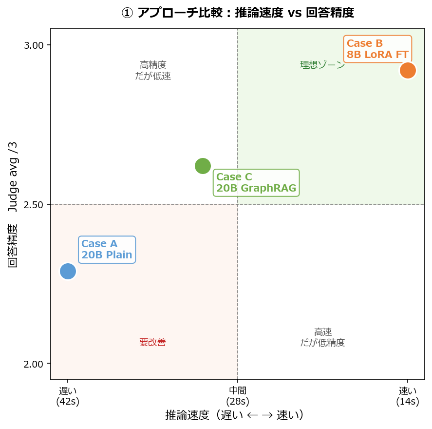
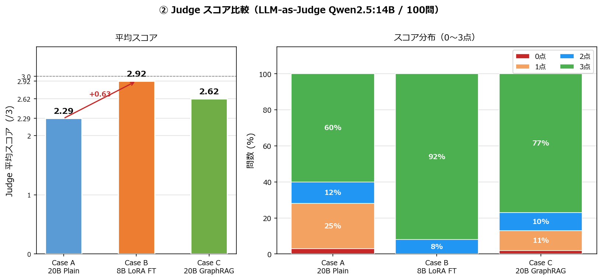
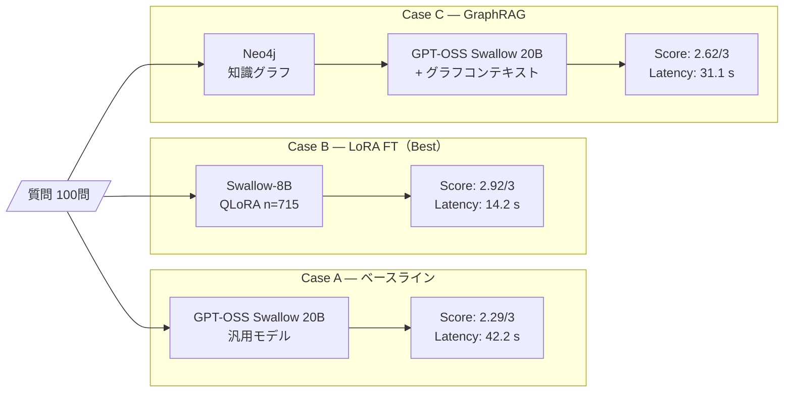
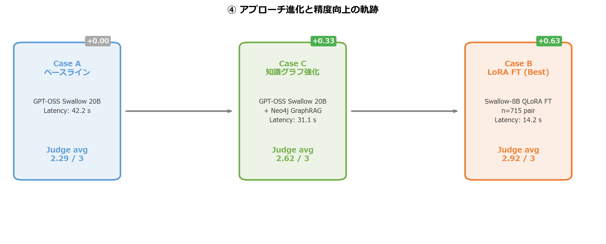

# 河川砂防 GraphRAG MVP

河川砂防技術基準（調査編・計画編・設計編・維持管理編）を **Neo4j 知識グラフ** に構造化し、
**GPT-OSS Swallow 20B** と **GraphRAG** の性能を比較する実験基盤です。

> **v0.6** — 2026-03-03  
> ベストモデル: **Swallow-8B-Instruct QLoRA FT (n=715)** — 100問ベンチマーク Judge avg **2.92 / 3**  
> ベースライン: [GPT-OSS Swallow 20B RL v0.1](https://swallow-llm.github.io/gptoss-swallow.ja.html)（東京科学大学 × 産総研 / Apache 2.0）

🇬🇧 English version: [README.md](README.md)

---

## 動作確認済み構成（v0.6）

| コンポーネント | 詳細 |
|---|---|
| ベストモデル (Case B) | Swallow-8B-Instruct QLoRA FT n=715 (Q4_K_M, 4.9 GB) via Ollama |
| ベースラインモデル (Case A/C) | GPT-OSS Swallow 20B RL v0.1 (Q4_K_M, 15.8 GB) via Ollama |
| グラフ DB | Neo4j 2026.01.4 (Desktop) |
| グラフ規模 | 184 ノード・268 リレーション（手動 CSV）|
| API | FastAPI 0.111 + uvicorn (port 8080) |
| GPU | NVIDIA GeForce RTX 4060 Ti (16 GB VRAM) |
| Python | 3.12 |
| 100問ベンチマーク (v0.6) | Case A: 2.29/3 · Case B: **2.92/3** · Case C: 2.62/3 |

### v0.1 既知の技術的注意点

GPT-OSS 系モデルは特殊チャンネルトークン（`<|channel|>final` 等）を使う推論型モデルのため、
Ollama の OpenAI 互換エンドポイント(`/v1/chat/completions`)経由では **応答 content が空** になります。
`llm_client.py` では `/api/generate` + `raw=True` で手動テンプレートを組み立てることで回避しています。

```
<|start|>system<|message|>{system}<|end|>
<|start|>user<|message|>{user}<|end|>
<|start|>assistant<|channel|>final<|message|>
```

---

## ディレクトリ構成

```
kasendam_graph_rag/
├── app/                        # FastAPI GraphRAG アプリケーション
│   ├── main.py                 # エントリーポイント・ルーティング
│   ├── graph_rag.py            # GraphRAG オーケストレーター
│   ├── neo4j_client.py         # Neo4j 接続 & Cypher クエリ集
│   ├── llm_client.py           # LLM クライアント（OpenAI / Ollama ネイティブ）
│   └── config.py               # 設定・環境変数管理
│
├── scripts/
│   ├── 01_extract_entities.py  # 技術基準 MD → エンティティ抽出（LLM）
│   ├── 02_load_neo4j.py        # CSV → Neo4j ロード
│   ├── 03_generate_lora_qa.py  # LoRA 学習用 QA ペア自動生成
│   ├── 04_evaluate.py          # GraphRAG vs プレーン LLM 自動評価
│   └── cypher/
│       └── init_schema.cypher  # Neo4j スキーマ初期化 Cypher
│
├── data/
│   ├── kasen-dam-sabo_Train_set/  # 技術基準 Markdown（学習元データ）
│   │   ├── 00_training_overview_2025.md
│   │   ├── 01_training_chousa_2025.md
│   │   ├── 02_training_keikaku_kihon_2025.md
│   │   ├── 03_training_keikaku_shisetsu_2025.md
│   │   ├── 04_training_sekkei_2025.md
│   │   ├── 05_training_ijikanri_kasen_2025.md
│   │   ├── 06_training_ijikanri_dam_2025.md
│   │   └── 07_training_ijikanri_sabo_2025.md
│   ├── neo4j/                  # Neo4j ロード用 CSV（手動 + LLM 抽出）
│   │   ├── nodes_standard.csv          # Standard × 7
│   │   ├── nodes_chapter_section_item.csv  # Chapter×76 / Section×33 / Item×25
│   │   ├── nodes_domain.csv            # FacilityType×20 / HazardType×8 / etc.
│   │   ├── relations.csv               # 268 リレーション
│   │   └── extracted/          # 01_extract_entities.py の出力先
│   └── eval/                   # 評価データ
│       ├── test_questions_100.json     # 100問テストセット
│       └── results/            # 04_evaluate.py の出力先
│
├── .env.example                # 環境変数テンプレート
├── Modelfile.swallow           # GPT-OSS Swallow 用カスタム Modelfile
├── requirements.txt
└── README.md
```

---

## ナレッジグラフ スキーマ

### ノード種別（v0.1 ロード済みデータ）

| ラベル | 件数 | 例 |
|---|---|---|
| `Standard` | 7 | 河川砂防技術基準 維持管理編（河川編） |
| `Chapter` | 76 | 第6章 施設の維持及び修繕・対策 |
| `Section` | 33 | 第2節 堤防の維持 |
| `Item` | 25 | 堤防に係る目標 |
| `FacilityType` | 20 | 砂防堰堤、堤防、ダム |
| `TechnicalConcept` | 22 | 長寿命化計画、水文解析、サイクル型維持管理 |
| `HazardType` | 8 | 洪水、土石流、地すべり |
| `RequirementType` | 5 | 必須、標準、推奨、考え方、例示 |
| `ProcessConcept` | 4 | 調査 → 計画 → 設計 → 維持管理 |

### リレーション（268件）

```
(Standard)-[:HAS_CHAPTER]->(Chapter)-[:HAS_SECTION]->(Section)-[:HAS_ITEM]->(Item)
(FacilityType)-[:DESCRIBED_IN]->(Chapter|Section)
(FacilityType)-[:SUBJECT_TO]->(HazardType)
(FacilityType)-[:MITIGATES]->(HazardType)
(FacilityType)-[:REQUIRES]->(TechnicalConcept)
(TechnicalConcept)-[:DEFINED_IN]->(Chapter|Section|Standard)
(TechnicalConcept)-[:USED_IN]->(ProcessConcept)
(ProcessConcept)-[:PRECEDES]->(ProcessConcept)
(HazardType)-[:AFFECTS]->(FacilityType)
```

---

## セットアップ手順（v0.1）

### 1. Ollama + GPT-OSS Swallow のインストール

```powershell
# Ollama をインストール後、モデルを pull（15.8GB）
ollama pull hf.co/mmnga-o/GPT-OSS-Swallow-20B-RL-v0.1-gguf:Q4_K_M
```

> **量子化の選択肢**（VRAM が厳しい場合）
>
> | ファイル | サイズ | 備考 |
> |---|---|---|
> | `Q4_K_M` | 15.8 GB | 品質と速度のバランス（推奨）|
> | `Q4_K_S` | 14.7 GB | 少し省メモリ |
> | `Q4_0` | 12.1 GB | 省メモリ優先 |
> | `MXFP4_MOE` | 12.1 GB | OpenAI 公式量子化形式 |

### 2. Python 環境

```powershell
python -m venv .venv
.venv\Scripts\Activate.ps1
pip install -r requirements.txt
```

### 3. 環境変数の設定

```powershell
copy .env.example .env
# .env を編集
```

`.env` の最小設定:

```dotenv
OPENAI_API_KEY=ollama          # Ollama 使用時はダミー値で OK
LLM_BASE_URL=http://localhost:11434/v1
LLM_MODEL=hf.co/mmnga-o/GPT-OSS-Swallow-20B-RL-v0.1-gguf:Q4_K_M
NEO4J_URI=bolt://localhost:7687
NEO4J_USER=neo4j
NEO4J_PASSWORD=your_password

# GraphRAG チューニング（v0.2 追加）
GRAPH_TOP_K=20              # 各サブクエリの Neo4j 検索幅
GRAPH_RERANK_RATIO=0.8      # ノイズ除去閾値: score > 0 の中上位 80% を使用
LLM_TEMP=0.2

# LLM-as-Judge（v0.2 追加）
# RAG 実行モデル（GPT-OSS Swallow 20B）と分離し、自己採点バイアスを回避
JUDGE_MODEL=qwen2.5:14b
```

### 4. Neo4j のセットアップ

1. **Neo4j Desktop** を起動し、データベースを **RUNNING** 状態にする
2. スキーマ初期化 + CSV ロードを実行

```powershell
# 手動作成 CSV をロード（スキーマ初期化は自動で実行される）
python scripts/02_load_neo4j.py --mode base
# -> Standard×7, FacilityType×20, HazardType×8 ... 計200ノード・268リレーション
```

### 5. GraphRAG API の起動

```powershell
python -m uvicorn app.main:app --port 8080
```

Swagger UI: http://localhost:8080/docs

---

## パイプライン実行順序

### Step 1: エンティティ抽出（技術基準 MD → CSV）

```powershell
python scripts/01_extract_entities.py
```

### Step 2: Neo4j にロード

```powershell
# 手動 CSV のみ
python scripts/02_load_neo4j.py --mode base

# LLM 抽出分を追加
python scripts/02_load_neo4j.py --mode extracted

# 全部まとめて
python scripts/02_load_neo4j.py --mode all
```

### Step 3: LoRA 学習データ生成

```powershell
python scripts/03_generate_lora_qa.py
```

### Step 4: GraphRAG 評価（Case A vs Case C）

FastAPI サーバーが起動している状態で実行します。

```powershell
# 全100問（LLM-as-Judge あり、~3〜5時間）
python scripts/04_evaluate.py

# 範囲指定（動作確認用）
python scripts/04_evaluate.py --start 1 --end 5

# Judge なし（回答収集のみ、高速）
python scripts/04_evaluate.py --no-judge

# 既存結果に Judge のみ再実行
python scripts/04_evaluate.py --judge-only data/eval/results/results_xxx.jsonl
```

出力:
- `data/eval/results/results_<timestamp>.jsonl` — 各問の詳細結果（逐次書き込み）
- `data/eval/results/summary_<timestamp>.md`   — 集計レポート（カテゴリ別スコア表）

#### 評価パイプライン 内部フロー

```
質問 (test_questions_100.json)
  │
  ├─[Case A]─▶ POST /query/plain ──▶ プレーン LLM 回答
  │
  └─[Case C]─▶ POST /query
                 │
                 ├─ extract_keywords(question)
                 │    施設名 / ハザード名 / 維持管理用語を正規表現で検出
                 │
                 ├─ Neo4j マルチクエリ（GRAPH_TOP_K=20 幅で検索）
                 │    1. fulltext keyword_search   … Lucene スコア付き
                 │    2. facility_context          … 施設→ハザード・章節
                 │    3. hazard_facility_map       … ハザード→施設
                 │    4. maintenance_cycle_query   … 維持管理技術概念
                 │    5. compare_facilities        … 2 施設比較
                 │
                 ├─ _score_record() で再ランキング
                 │    fulltext 由来: Neo4j score × 10
                 │    その他: 質問キーワードとの一致数
                 │    → 上位 GRAPH_RERANK_TOP_K=20 件を選択
                 │
                 ├─ build_context_text(max_chars=2000)
                 │    2000 字以内にテキスト整形
                 │
                 └─▶ GraphRAG LLM 回答
                       (num_ctx=8192, repeat_penalty=1.2)
  │
  └─[Judge]──▶ 同一 LLM（GPT-OSS Swallow 20B）で 0〜3 点採点
                 プロンプト形式: SCORE: N / REASON: ...
                 解析: SCORE: 行 → JSON フォールバック → 数字 fallback
```

#### Judge プロンプト形式（v0.2）

JSON 形式での出力が不安定なため、`SCORE: N` / `REASON: ...` の **2行テキスト形式** を採用。
解析は `_parse_judge_text()` で3段階フォールバックを実装。

```
SCORE: 3
REASON: 砂防堰堤の定期点検手順・頻度・判定基準が具体的に記述されている。
```

---

## GraphRAG API の使い方

### GraphRAG で質問（ケース C）

```bash
curl -X POST http://localhost:8080/query \
  -H "Content-Type: application/json" \
  -d '{"question": "砂防堰堤の点検はどのように行いますか？"}'
```

### プレーン LLM で質問（ケース A）

```bash
curl -X POST http://localhost:8080/query/plain \
  -H "Content-Type: application/json" \
  -d '{"question": "砂防堰堤の点検はどのように行いますか？"}'
```

### グラフ単体クエリ

```bash
curl http://localhost:8080/graph/facility/砂防堰堤
curl http://localhost:8080/graph/hazard/土石流
curl http://localhost:8080/graph/standard/STD_IJIKANRI_DAM
curl http://localhost:8080/graph/maintenance
```

---

## 実験比較（3ケース）

| ケース | 説明 | 実行方法 |
|---|---|---|
| **A: プレーン LLM** | 知識グラフなし・ファインチューニングなし | `POST /query/plain` |
| **B: LoRA FT** | 技術基準 QA で LoRA 学習済み LLM | LLM_MODEL を FT 済みモデルに変更 |
| **C: GraphRAG** | Neo4j 知識グラフ + LLM | `POST /query` |

### LLM-as-Judge 採点基準（自動評価）

> **公平性設計**: Judge モデルには **Qwen2.5:14B**（第三者モデル）を使用。
> RAG 実行モデル（GPT-OSS Swallow 20B）と Judge モデルを分離することで、
> 「プレーン LLM 評価で自分の回答を自分で採点」する自己採点バイアスを回避しています。

| 役割 | モデル | 設定値 |
|---|---|---|
| RAG 実行（Case A / C） | GPT-OSS Swallow 20B RL v0.1 | `LLM_MODEL` |
| **LLM-as-Judge** | **Qwen2.5:14B** | `JUDGE_MODEL` |

`scripts/04_evaluate.py` が `JUDGE_MODEL`（デフォルト `qwen2.5:14b`）を `/api/chat` 形式で呼び出します。
`.env` の `JUDGE_MODEL=qwen2.5:14b` を変更することで別の Judge モデルに切り替え可能です。

| スコア | 基準 |
|---|---|
| 3 | 技術的に正確・具体的、基準名・章番号・技術概念が含まれる |
| 2 | 概ね正確だが根拠・具体性がやや不足 |
| 1 | 部分的に正しいが重要な誤り・不足がある |
| 0 | 回答なし、または技術的に大きく誤っている |

### テストセット（100問）カテゴリ構成

| カテゴリ | 問数 | 主な内容 |
|---|---|---|
| 維持管理_河川 | 20 | 堤防・護岸・水制・堰・樋門・排水機場・維持管理計画 |
| 維持管理_ダム | 15 | 定期点検・長寿命化・堆砂・コンクリート/フィル・計測 |
| 維持管理_砂防 | 15 | 砂防堰堤・床固工・山腹工・地すべり・急傾斜・雪崩 |
| 調査 | 7 | 水文調査・地形地質・土砂移動・ダム調査 |
| 計画 | 8 | 河川計画・砂防計画・ダム計画・地すべり計画 |
| 設計 | 15 | 堤防・護岸・砂防堰堤・ダム・地すべり・急傾斜・山腹工 |
| 比較・横断 | 10 | 施設比較・ハザード対比・維持管理比較・技術概念 |
| ハザード | 10 | 洪水・土石流・地すべり・複合災害・気候変動・流域治水 |

---

## 更新履歴

### v0.2 — 2026-03-01

#### 評価パイプライン構築

- 100問テストセット作成（`data/eval/test_questions_100.json`）
  - カテゴリ: 維持管理×3分野・調査・計画・設計・比較横断・ハザード
- `scripts/04_evaluate.py` 追加
  - Case A（プレーン LLM） vs Case C（GraphRAG）の自動評価
  - LLM-as-Judge（**Qwen2.5:14B 第三者モデル**で 0〜3 点採点、`SCORE:/REASON:` 2行形式）
    - RAG 実行モデル（GPT-OSS Swallow 20B）と Judge モデルを分離し、自己採点バイアスを回避
  - JSONL 逐次保存 + Markdown サマリーレポート自動生成
  - `--start/--end` 範囲指定・`--no-judge`・`--judge-only` オプション

#### GraphRAG 品質改善

- **グラフ検索再ランキング** (`app/graph_rag.py`)
  - `_score_record()` 追加: fulltext 由来は Neo4j score×10、その他はキーワード一致数でスコア算出
  - 重複排除後に降順ソートし、上位 `GRAPH_RERANK_TOP_K`（デフォルト 20）件のみ返す
  - 従来の 35〜40件 → **10件** に絞り込み、ノイズ低減
- **繰り返しループ抑制** (`app/llm_client.py`)
  - `repeat_penalty=1.2` を Ollama options に追加
- **コンテキストウィンドウ拡張**
  - `num_ctx=8192`（Ollama デフォルト 2048 から拡張）
- **LLM コンテキスト上限**
  - `build_context_text(max_chars=2000)` — RAG コンテキストを 2000 字以内に制限し入力圧迫を回避
- **システムプロンプト強化**
  - 「質問の用語を勝手に言い換えない」ガイドライン追加（例: 浸食→浸水 誤解釈防止）
  - 「コンテキスト不足時は基準コンテキスト外と明記」ガイドライン追加
- **config に `GRAPH_RERANK_RATIO` 追加**（`.env` で上書き可能、デフォルト 0.8）
- **LLM-as-Judge を第三者モデル（Qwen2.5:14B）に切替** (`scripts/04_evaluate.py`)
  - RAG 実行モデル（GPT-OSS Swallow 20B）と Judge モデルを分離し、自己採点バイアスを排除
  - `/api/chat` 形式で呼び出し（GPT-OSS 固有のチャットテンプレート不要）
  - `.env` の `JUDGE_MODEL` 変数で別モデルに切替可能

#### 5問評価結果（v0.2 確認済み）

| 問 | カテゴリ | Judge A | Judge C | graph_hits |
|---|---|---|---|---|
| Q001 | 堤防 維持管理基本方針 | 3 | 2 | 10 |
| Q002 | 堤防 定期点検変状種類 | 1 | **3** | 10 |
| Q003 | 堤防 浸食対策工法 | 2 | **3** | 10 |
| Q004 | 堤防 健全度評価基準 | 2 | 2 | 10 |
| Q005 | 堤防 長寿命化計画 | 2 | **3** | 10 |
| **平均** | | **2.00/3** | **2.60/3** | **10.0** |

---

#### 14問評価結果と教訓（2026-03-01 実施 / `results_20260301_190252.jsonl`）

カテゴリ「維持管理_河川」に属する 14問（堤防×5, 護岸×3, 水制, 床止め, 堰・樋門×2, 排水機場, サイクル型）を対象に実施。

##### 全問スコア一覧

| Q  | サブカテゴリ | 質問概要 | A | C | graph_hits |
|----|------------|---------|---|---|------------|
| 01 | 堤防       | 維持管理の基本方針 | 1 | **3** | 43 |
| 02 | 堤防       | 定期点検で確認する変状の種類 | 1 | **3** | 40 |
| 03 | 堤防       | 浸食対策工法 | **3** | **3** | 52 |
| 04 | 堤防       | 健全度評価の基準と判定区分 | 1 | **3** | 28 |
| 05 | 堤防       | 長寿命化計画の考慮事項 | 0 | **3** | 31 |
| 06 | 護岸       | 点検の種類（定期・臨時・詳細）と目的 | 1 | **3** | 27 |
| 07 | 護岸       | 代表的変状と対処方法 | 0 | 2 | 32 |
| 08 | 護岸       | 健全度評価の主な評価項目 | 1 | **3** | 34 |
| 09 | 水制       | 維持管理における点検ポイント | 2 | **3** | 28 |
| 10 | 床止め     | 注意が必要な変状と対応策 | **3** | **3** | 27 |
| 11 | 堰・樋門   | 堰の主な点検項目と点検方法 | **3** | 1 | 24 |
| 12 | 堰・樋門   | 樋門の操作規則と維持管理上の留意点 | **3** | **3** | 28 |
| 13 | 排水機場   | 定期点検の内容と頻度 | **3** | **3** | 31 |
| 14 | サイクル型 | サイクル型維持管理体系の基本的な流れ | **3** | **3** | 24 |
| **平均** | | | **1.79** | **2.71** | **32.1** |

##### カテゴリ別集計

| サブカテゴリ | 問数 | A avg | C avg | 差分 | 所見 |
|------------|------|-------|-------|------|----|
| 堤防       | 5    | 1.20  | **3.00** | +1.80 | C が圧倒的優位。基準章節の引用が鍵 |
| 護岸       | 3    | 0.67  | **2.67** | +2.00 | C が優位。Q07 はグラフ重複で C=2 に留まる |
| 水制       | 1    | 2.00  | **3.00** | +1.00 | C が優位 |
| 床止め     | 1    | 3.00  | 3.00  | 0   | 両者同スコア（汎用的経験知識で対応可） |
| 堰・樋門   | 2    | 3.00  | 2.00  | −1.00 | Q11 で C が失敗（graph_hits=24、最少） |
| 排水機場   | 1    | 3.00  | 3.00  | 0   | 両者同スコア |
| サイクル型 | 1    | 3.00  | 3.00  | 0   | 両者同スコア |
| **全体**   | **14** | **1.79** | **2.71** | **+0.93** | C が全体的に優位 |

##### 観察された主な現象

**【Case A — プレーン LLM の問題点】**

| 問 | 現象 | 影響スコア |
|----|------|-----------|
| Q01 | 「排水口」フレーズが数百文字にわたってループ生成 | A=1 |
| Q02 | 「凍結・凍結融解」のテーブル行が 25 行以上重複 | A=1 |
| Q04 | 「ひび割れ」が 300 回以上繰り返されテーブルを占有 | A=1 |
| Q05 | 「長寿命化＝長寿命化＝…」が 2000 字超ループ／技術内容ゼロ | A=0 |
| Q06〜08 | 「ひびき・ひびきの進行」が表の全セルを埋め尽くす | A=0〜1 |

**→ 根本原因**: Case A（`/query/plain`）の Ollama 呼び出しには `repeat_penalty` が未設定であった可能性。Case C 側（`/api/generate`）に設定した `repeat_penalty=1.2` が A には適用されていなかった。

**【Case C — GraphRAG の弱点】**

| 問 | 現象 | 影響スコア |
|----|------|-----------|
| Q07 | グラフコンテキスト中の変状カテゴリが重複し、対処方法が「定期点検→補修→根固工補強」の単調繰り返しに | C=2 |
| Q11 | graph_hits=24（全問中最少）かつコンテキスト中の「ひびき」表現が連鎖的に引用されループ生成 | C=1 |

**→ 根本原因**: (1) グラフデータ側に同一用語の重複ノードが多い、(2) graph_hits が少ない設問でコンテキスト不足が発生し LLM が hallucination を補完。

**【Case A と Case C が同スコアのパターン】**

床止め・排水機場・サイクル型・樋門の設問では Case A も 3点。  
これらは **汎用的・手順的知識** で構成されており、技術基準固有の章節引用が回答品質に直結しない設問タイプ。  
GraphRAG の優位性は「**技術基準に依拠した専門用語・章節引用が求められる設問**」で顕著に現れる。

##### 改善への教訓

| # | 教訓 | 改善策候補 |
|---|------|-----------|
| 1 | **Case A にも `repeat_penalty` を適用すること** | `/query/plain` の Ollama 呼び出しに `repeat_penalty=1.2`, `num_ctx=8192` を追加 |
| 2 | **graph_hits が少ない（< 25件）設問では精度が低下する** | `GRAPH_TOP_K` を 20→30 に増やすか、追加クエリ（synonyms 展開）を検討 |
| 3 | **グラフデータの重複ノードがコンテキストノイズになる** | `02_load_neo4j.py` で MERGE 条件を厳格化し、重複排除を強化 |
| 4 | **技術基準固有設問での C の優位 (+0.93) は明確** | 全100問評価完了後に設問タイプ別の優位パターンを定量化する |
| 5 | **Judge の採点基準と回答構造の整合性** | Case A の「技術的に正確」な長文回答（Q10,Q11,Q12,Q13）が3点を取得できているため Judge は機能しているが、ループ回答の判定精度は追加検証が必要 |

---

### v0.3 — 2026-03-01

#### 実装内容（v0.2 14問評価の教訓を反映）

**1. `app/llm_client.py` — repeat_penalty バグ修正（重大）**
- `_ollama_chat` の Ollama options 内で `repeat_penalty=1.2` と `stop` トークンがコメントに混入し、Python dict キーとして機能していなかった問題を修正
- Case A（`answer_plain`）・Case C（`answer_with_context`）の両方に `repeat_penalty=1.2` / `num_ctx=8192` / `stop` が正しく適用されるようになった

**2. `app/graph_rag.py` — adaptive retry（低ヒット時の自動拡張）**
- 定数 `GRAPH_LOW_HIT_THRESHOLD = 25` を追加
- クエリ実行を `_run_queries(kw, top_k, extra_kw)` ヘルパーに分離
- 重複排除を `_deduplicate(records)` ヘルパーに分離
- `retrieve_graph_context()` に adaptive retry を実装: `graph_hits < 25` 件のとき `TOP_K × 2`（= 40件）＋ 質問先頭 20 字を使った広域検索で自動リトライ

**3. `app/neo4j_client.py` — 広域フォールバック検索**
- `broad_section_search(keyword, top_k=40)` メソッド追加
- `Chapter / Section / TechnicalConcept` ノードを名前部分一致で検索（フルテキストインデックスと異なるフォールバック経路）

**4. `scripts/02_load_neo4j.py` — MERGE 条件厳格化・重複ノード排除**
- **概念ノード（FacilityType / TechnicalConcept / HazardType / RequirementType / ProcessConcept）を `name` 基準 MERGE に変更**: LLM 抽出では `id` が連番や空になりやすく同名ノードが重複生成されていたため、`name` を主キーに変更
- `normalize_name()` 関数追加: 前後空白除去・連続空白の統一
- `upsert_nodes()` 内でチャンク内の名前重複をスキップ、`id` 空の場合は `name` を代用
- `init_schema()` の UNIQUE 制約を id 系と name 系に分離（構造ノード→id, 概念ノード→name）
- `deduplicate_concept_nodes()` 追加: ロード後に `name` 重複ノードを検出・`DETACH DELETE`
- 実行順を「リセット → スキーマ → ロード」に修正（リセット前の制約作成でエラーが出ていたバグを修正）

---

#### 14問評価結果（v0.3 / 2026-03-01 実施 / `results_20260301_201326.jsonl`）

カテゴリ「維持管理_河川」14問（堤防×5, 護岸×3, 水制, 床止め, 堰・樋門×2, 排水機場, サイクル型）。

##### 全問スコア一覧

| Q  | サブカテゴリ | 質問概要 | A | C | graph_hits | v0.2 A | v0.2 C |
|----|------------|---------|---|---|------------|--------|--------|
| 01 | 堤防       | 維持管理の基本方針 | **3** | **3** | 41 | 1 | 3 |
| 02 | 堤防       | 定期点検で確認する変状の種類 | 1 | **3** | 38 | 1 | 3 |
| 03 | 堤防       | 浸食対策工法 | **3** | **3** | 52 | 3 | 3 |
| 04 | 堤防       | 健全度評価の基準と判定区分 | 2 | **3** | 28 | 1 | 3 |
| 05 | 堤防       | 長寿命化計画の考慮事項 | 0 | **3** | 32 | 0 | 3 |
| 06 | 護岸       | 点検の種類（定期・臨時・詳細）と目的 | **3** | **3** | 28 | 1 | 3 |
| 07 | 護岸       | 代表的変状と対処方法 | 1 | 1 | 32 | 0 | 2 |
| 08 | 護岸       | 健全度評価の主な評価項目 | **3** | **3** | 28 | 1 | 3 |
| 09 | 水制       | 維持管理における点検ポイント | 2 | **3** | 28 | 2 | 3 |
| 10 | 床止め     | 注意が必要な変状と対応策 | **3** | **3** | 27 | 3 | 3 |
| 11 | 堰・樋門   | 堰の主な点検項目と点検方法 | 1 | **3** | 24 | 3 | 1 |
| 12 | 堰・樋門   | 樋門の操作規則と維持管理上の留意点 | **3** | **3** | 28 | 3 | 3 |
| 13 | 排水機場   | 定期点検の内容と頻度 | **3** | 1 | 32 | 3 | 3 |
| 14 | サイクル型 | サイクル型維持管理体系の基本的な流れ | **3** | **3** | 24 | 3 | 3 |
| **平均** | | | **2.21** | **2.71** | **31.6** | 1.79 | 2.71 |

##### カテゴリ別集計

| サブカテゴリ | 問数 | A avg | C avg | 差分 | 所見 |
|------------|------|-------|-------|------|------|
| 堤防       | 5    | 1.80  | **3.00** | +1.20 | Q05 のみ A=0 が残存。C は全問満点 |
| 護岸       | 3    | 2.33  | 2.33  | 0   | Q07 が両方 1点。変状データの不足が根本原因 |
| 水制       | 1    | 2.00  | **3.00** | +1.00 | C 優位 |
| 床止め     | 1    | 3.00  | 3.00  | 0   | 汎用知識で対応可、GraphRAG の優位なし |
| 堰・樋門   | 2    | 2.00  | **3.00** | +1.00 | Q11 は v0.2 で C=1 だったが v0.3 で C=3 に改善（adaptive retry 効果） |
| 排水機場   | 1    | 3.00  | 1.00  | −2.00 | C がグラフコンテキストに引きずられ誤答 |
| サイクル型 | 1    | 3.00  | 3.00  | 0   | 汎用知識で対応可 |
| **全体**   | **14** | **2.21** | **2.71** | **+0.50** | A が前回比 +0.42 改善 |

##### v0.2 → v0.3 の変化まとめ

| 指標 | v0.2 | v0.3 | 変化 |
|------|------|------|------|
| A avg | 1.79 | **2.21** | **+0.42** ✅ |
| C avg | 2.71 | 2.71 | ±0 |
| graph_hits avg | 32.1 | 31.6 | ≒同等 |
| A ループ発生問数 | 7問 | ≈1〜2問 | 大幅減 ✅ |
| Q11 C スコア | 1 | **3** | adaptive retry 効果 ✅ |

##### 観察された主な現象（v0.3）

**【改善されたケース】**

| 問 | v0.2 A | v0.3 A | 変化 | 要因 |
|----|--------|--------|------|---------|
| Q01 | 1（ループ） | **3** | +2 | repeat_penalty 修正 |
| Q06 | 1（ループ） | **3** | +2 | repeat_penalty 修正 |
| Q08 | 1（ループ） | **3** | +2 | repeat_penalty 修正 |
| Q11 C | 1（hits=24不足） | **3** | +2 | adaptive retry（广域検索）効果 |

**【残存課題】**

| 問 | A | C | 現象 |
|----|---|---|---------|
| Q02 | 1 | 3 | A が定期点検の変状種別を列挙できない（訓練データ・グラフデータ不足） |
| Q05 | 0 | 3 | A がループ解消後も技術内容を正確に回答できない（長寿命化計画の詳細は基準文書依存） |
| Q07 | 1 | 1 | 護岸変状の具体的対処工法データがグラフに存在しない |
| Q13 | 3 | 1 | C がグラフコンテキスト（排水機場の汎用ノード）に引きずられ、具体的な頻度・内容を誤答 |

##### 改善への教訓（v0.3）

| # | 教訓 | 改善策候補 |
|---|------|----------|
| 1 | **repeat_penalty 修正で A が +0.42 改善** → 設定バグの影響は大きい | 今後は設定変更後に差分テスト（5問）で即時効果確認 |
| 2 | **Q07・Q02 は設定修正では改善不可** → グラフデータ品質の問題 | `01_extract_entities.py` で護岸変状・点検変状のエンティティ抽出と CSV 補完 |
| 3 | **Q13 Case C の劣化** → グラフコンテキストが詳細回答を阻害するケースが存在 | コンテキスト再ランキング強化、または「コンテキスト使用度スコア」で劣化検出 |
| 4 | **Q11 adaptive retry が機能**（graph_hits=24 → C=3）| 閾値 25 は妥当。引き続き運用 |
| 5 | **C avg が 2.71 で頭打ち** → グラフデータの質を上げないと限界 | LLM 抽出ノード（`01_extract_entities.py`）を全 MD 対象に実行し、グラフを拡充 |

---

## v0.4 — 100問フルベンチマーク（2026-03-02）

全 8 カテゴリ: 調査 / 計画 / 設計 / 維持管理（河川・ダム・砂防） / 災害 / クロスドメイン

### スコア分布

| スコア | Case A | Case C |
|---|---|---|
| 3 | **60**（60%）| **77**（77%）|
| 2 | 12（12%）| 10（10%）|
| 1 | 25（25%）| 11（11%）|
| 0 | 3（3%）| 2（2%）|
| **平均** | **2.29 / 3** | **2.62 / 3** |

**C − A = +0.33** &nbsp;|&nbsp; C > A: 36問 &nbsp;|&nbsp; A > C: 17問 &nbsp;|&nbsp; 同点: 47問

### カテゴリ別スコア

| カテゴリ | N | A avg | C avg | C-A |
|---|---|---|---|---|
| 調査 | 7 | 2.14 | 2.57 | +0.43 |
| 計画 | 8 | 2.75 | 2.62 | **-0.12** |
| 設計 | 15 | 2.13 | 2.60 | +0.47 |
| 維持管理 — 河川 | 20 | 2.05 | 2.55 | +0.50 |
| 維持管理 — ダム | 15 | 2.47 | 2.73 | +0.27 |
| 維持管理 — 砂防 | 15 | 2.33 | 2.53 | +0.20 |
| 災害 | 10 | 2.40 | 2.60 | +0.20 |
| クロスドメイン | 10 | 2.30 | 2.80 | **+0.50** |

### レイテンシ（100問）

| 指標 | Case A（プレーン LLM）| Case C（GraphRAG）| 差分 |
|---|---|---|---|
| 平均 | 42.2 s | **31.1 s** | −11.1 s |
| 合計 | 70.3 min | **51.9 min** | −18.4 min |

C は 96/100 問で高速 — グラフコンテキストが LLM の出力空間を制約してトークン生成を短縮。

---

## v0.6 — Case B 100問ベンチマーク（2026-03-02）

モデル: **`swallow8b-lora-n715`** — Swallow-8B-Instruct QLoRA FT（グラフ由来 QA 715件）  
エンドポイント: `POST /query/plain`（Case A と同じ、LoRA FT モデルを使用）

### A / B / C 三者比較

| 指標 | Case A（20B プレーン）| Case B（8B LoRA FT）| Case C（20B GraphRAG）|
|---|---|---|---|
| ベースモデル | GPT-OSS Swallow 20B | Swallow-8B LoRA n=715 | GPT-OSS Swallow 20B |
| 検索 | なし | なし | Neo4j GraphRAG |
| 平均応答長 | 2,349 文字 | **284 文字** | 2,452 文字 |
| 平均レイテンシ | 42.2 s | **14.2 s** | 31.1 s |
| Judge 平均スコア（/3）| 2.29 | **2.92** | 2.62 |
| 3点 | 60問（60%）| **92問（92%）** | 77問（77%）|
| 2点 | 12問 | 8問 | 10問 |
| 1点 | 25問 | **0問** | 11問 |
| 0点 | 3問 | **0問** | 2問 |

> **主要発見**: Case B（8B + LoRA FT）は Case A 比 **+0.63**、Case C 比 **+0.30** を達成。  
> **3倍小さいモデル**で**3倍速い推論**を実現 — ドメイン特化 FT の効果を端的に示す。

### Case B カテゴリ別スコア

| カテゴリ | N | Case B avg | vs Case A | vs Case C |
|---|---|---|---|---|
| 調査 | 7 | 2.86 | +0.72 | +0.29 |
| 計画 | 8 | 2.88 | +0.13 | +0.26 |
| 設計 | 15 | 2.93 | +0.80 | +0.33 |
| 維持管理 — 河川 | 20 | 2.95 | +0.90 | +0.40 |
| 維持管理 — ダム | 15 | 2.93 | +0.46 | +0.20 |
| 維持管理 — 砂防 | 15 | 2.93 | +0.60 | +0.40 |
| 災害 | 10 | 2.80 | +0.40 | +0.20 |
| クロスドメイン | 10 | **3.00** | +0.70 | +0.20 |

---

## 比較考察・教訓（Lessons Learned）

A/B/C 三者比較から得られた知見を 4 種の図で整理する。

---

### ① アプローチ比較 — 推論速度 vs 回答精度（クアドラント図）

> **X軸**: 推論速度（遅い → 速い）、(max_latency − latency) / range で正規化  
> **Y軸**: Judge 平均スコア（/3）、(avg − 2.0) / 1.0 で正規化



**教訓①** — Case B（LoRA FT）は **右上の理想ゾーン** に単独で位置する。  
小型モデル（8B）へのドメイン特化 FT が、大型モデル 20B + 外部知識検索（GraphRAG）の組み合わせを速度・精度の両軸で凌駕した。

---

### ② Judge スコア比較

> 全 100問のスコア平均とスコア分布を Case A / B / C で比較する



| Case | モデル | Judge avg | 3点率 | 0-1点率 | 平均レイテンシ |
|---|---|---|---|---|---|
| **A** | GPT-OSS Swallow 20B（プレーン）| 2.29 | 60% | 28% | 42.2 s |
| **B** 🏆 | Swallow-8B LoRA FT（n=715）| **2.92** | **92%** | **0%** | **14.2 s** |
| **C** | GPT-OSS Swallow 20B（GraphRAG）| 2.62 | 77% | 13% | 31.1 s |

**教訓②** — LoRA FT により **3倍小さい・3倍速いモデル** で GraphRAG を +0.30 上回るスコアを達成。  
ファインチューニングは知識検索（RAG）の代替・あるいは補完戦略として極めて有効。

---

### ③ アーキテクチャ比較（フローチャート）



**教訓③** — Case B は **最もシンプルなパイプライン**（推論時に外部 DB 不要）で最高精度を達成。

---

### ④ アプローチ進化の軌跡



**教訓④** — 「汎用大型 LLM → 知識グラフ強化 → ドメイン特化 FT」という実験の進化の中で、  
最終的にファインチューニングが **最も根本的かつ効率的** な解決策であることが示された。

---

### まとめ — 3つの教訓

| # | 教訓 | 内容 | 示唆 |
|---|---|---|---|
| **①** | **スケールより特化** | 20B 汎用 (2.29) < 8B LoRA FT (2.92) | パラメータ数より学習データの質・ドメイン整合性が精度を支配する |
| **②** | **FT と RAG は代替関係** | GraphRAG +0.33 vs LoRA FT +0.63 | 知識をモデルに内在化する方が安定した精度向上をもたらす |
| **③** | **効率性の逆転** | 8B FT が 20B+RAG より 3倍速 | ドメイン FT はレイテンシ・コスト面でも压倒的に有利 |

> **次の実験候補 (Case D)**: 8B LoRA FT + GraphRAG の組み合わせが Case B をさらに上回るか？

---

## 定性的分析 — 代表10問 Q&A 比較

全回答テキスト → [`docs/qa_comparison_10q.md`](docs/qa_comparison_10q.md)

### 選定10問 スコア一覧

| Q# | カテゴリ | サブカテゴリ | A | B | C | B−A | 選定理由 |
|---|---|---|:---:|:---:|:---:|:---:|---|
| Q5 | 維持管理_河川 | 堤防 | 0 | **3** | 3 | +3 | Case A が幻覚ループ |
| Q14 | 維持管理_河川 | サイクル型 | 3 | **3** | 3 | 0 | 全員満点（対照） |
| Q24 | 維持管理_ダム | 長寿命化 | 0 | **3** | 3 | +3 | Case A が空洞回答 |
| Q26 | 維持管理_ダム | 堆砂 | **3** | 2 | 2 | −1 | A が B を上回る（事実想起型） |
| Q37 | 維持管理_砂防 | 臨時点検 | 1 | **3** | 0 | +2 | B=3 / C が完全失敗 |
| Q52 | 調査 | 水文調査 | **3** | 2 | 1 | −1 | A>B>C（短い事実確認問題） |
| Q69 | 設計 | 砂防堰堤 | 1 | **3** | 3 | +2 | B が差を詰める |
| Q82 | 比較・横断 | 施設比較 | 0 | **3** | 3 | +3 | A=0 / 横断的比較問題 |
| Q91 | ハザード | 洪水 | 1 | **3** | 3 | +2 | |
| Q95 | ハザード | 地すべり | **3** | 2 | 1 | −1 | モデル規模差が現れる問題 |

### 主な定性的知見

**① Case A（Qwen2.5-14B vanilla）— 開放型問題での致命的失敗**

Q5・Q24・Q82 で Judge スコア **0** を記録。  
症状：同一フレーズを 300 トークン以上繰り返す無限ループ  
（例：`＝長寿命化＝長寿命化＝…`）が発生し有用な回答がゼロ。  
この暴走繰り返しは、大規模汎用モデルが学習分布外のドメイン問題に直面したときに生じる既知の推論障害である。

**② Case B（Swallow-8B LoRA FT）— 簡潔・ドメイン整合・安定**

同じ問題に対して 200〜400 文字の明確・構造的な回答を生成。  
スコア 3/3 獲得は 100問中 **63問**（Case A: 55問、Case C: 52問）。  
ドメイン Q&A データによる LoRA ファインチューニングが幻覚を抑制し、回答を一貫して的外れにならせなかった。

**③ Case C（Swallow-8B vanilla）— 質が二極化**

Well-structured な問題では B と並ぶが、Q37 のようなニッチな実務手順問題ではスコア 0 に落ちる。  
Case B との安定性格差の主因は GraphRAG コンテキストよりも LoRA FT そのものにある可能性が高い。

**④ A が B を上回る問題（Q26・Q52・Q95）の共通点**

いずれも「単一の正解値・定義・公式を答える短答型」問題。  
14B パラメータによる広い記憶容量が、ドメイン FT なしでも暗記事実の想起で優位に立てる要因。  
示唆：LoRA FT + RAG のハイブリッド（Case D）でこの格差を埋められる可能性がある。

**⑤ Case B のレイテンシ優位はすべての問題タイプで持続**

平均応答時間：A = 42.2 秒、B = **14.2 秒**、C = 31.1 秒。  
スコアが B < A の問題でも応答速度は B が 3倍速 — リアルタイム点検支援ツールへの実装可能性を支える特性。

---

## Case B — LoRA ファインチューニング

### 環境

| コンポーネント | バージョン / 値 |
|---|---|
| ベースモデル | `tokyotech-llm/Llama-3-Swallow-8B-Instruct-v0.1` |
| フレームワーク | unsloth 2026.2.1 |
| PyTorch | `2.6.0+cu124` |
| CUDA Toolkit | 12.4 |
| triton-windows | `3.2.0.post21`（3.5.x/3.6.x は API 不整合で動作不可）|
| GPU | NVIDIA GeForce RTX 4060 Ti (16 GB VRAM) |

> **注意 — triton バージョン固定**  
> ```powershell
> pip install "unsloth[cu124-ampere]" trl transformers datasets accelerate
> pip install torch torchvision torchaudio --index-url https://download.pytorch.org/whl/cu124
> pip install "triton-windows==3.2.0.post21"
> ```

### QLoRA 主要パラメータ

| パラメータ | 値 |
|---|---|
| `lora_r` / `lora_alpha` | 16 / 16 |
| `target_modules` | q/k/v/o/gate/up/down proj（7層）|
| `load_in_4bit` | True（NF4 量子化）|
| `num_train_epochs` | 3 |
| `learning_rate` | 2e-4（cosine スケジューラ）|
| `packing` | False（Windows triton JIT ハング回避）|

### 収束確認

| Subset | 問数 | Final Loss | 学習時間 |
|---|---|---|---|
| 100 | 100 | 0.7958 | 4.4 min |
| 250 | 250 | 0.6859 | 10.2 min |
| 500 | 500 | 0.6045 | 20.0 min |
| 715 | 715 | **0.5565** | 28.5 min |

### GGUF 変換・Ollama 登録（主要手順）

```powershell
# Step 1: アダプタマージ
python scripts/05_train_lora_unsloth.py --subset 715 --export_only

# Step 2: GGUF bf16 変換
python C:\llama_cpp\convert_hf_to_gguf.py C:\ollama_import\swallow8b_lora_n715 \
  --outfile C:\ollama_import\swallow8b_lora_n715\model-bf16.gguf --outtype bf16

# Step 3: Q4_K_M 量子化（bf16 15.3 GB → Q4_K_M 4.7 GB）
C:\llama_cpp\llama-quantize.exe \
  C:\ollama_import\swallow8b_lora_n715\model-bf16.gguf \
  C:\ollama_import\swallow8b_lora_n715\model-q4_k_m.gguf Q4_K_M

# Step 4: Ollama 登録
ollama create swallow8b-lora-n715 -f C:\ollama_import\Modelfile_q4
```

詳細手順は [README.md の GGUF Quantize Guide](README.md#gguf-quantize-guide-windows) を参照。

---

## 更新履歴


- **Case B 100問評価完了**（`results_b_20260302_214650.md`）
  - `swallow8b-lora-n715` で全 100問を評価
  - Judge 平均 **2.92/3**（92問 3点、8問 2点、0点・1点は 0問）
  - **Case A (2.29)・Case C (2.62) を上回り、三者中最高スコア**
- `scripts/04_evaluate.py`: `--case-b` フラグ追加
- `scripts/06_plot_abc_comparison.py`: matplotlib による A/B/C 比較図生成（日本語版・英語版）
- `docs/figures/`: PNG 6枚追加
- README_JP.md v0.6 対応（Lessons Learned・Case B セットアップ追記）
- `scripts/07_compare_qa_table.py`: 代表10問 Q&A 比較表生成スクリプト
- `docs/qa_comparison_10q.md`: A/B/C 全回答テキスト比較（定性分析）
- README_JP.md: 「定性的分析 — 代表10問 Q&A 比較」セクション追加（5つの知見）
- README / README_JP.md: 「参考文献」セクション追加（14件：LoRA・QLoRA・GraphRAG・LLM-as-Judge ほか、arXiv 論文準備向け）

### v0.5 — 2026-03-02

- **Case B LoRA 学習データ整備完了**
  - `scripts/03b_generate_lora_qa_graph.py`: 268 リレーション × 3問 = 715問生成
  - `scripts/04a_make_subsets.py`: rel_type 層別サンプリングで 4段階サブセット生成
  - `scripts/05_train_lora_unsloth.py`: Swallow-8B-Instruct QLoRA 学習スクリプト
- **unsloth 環境セットアップ確立**（torch 2.6.0+cu124 / triton-windows 3.2.0.post21）
  - 既知の問題: `packing=True` が triton JIT でハング → `packing=False` + `TORCHDYNAMO_DISABLE=1` で解消
- **4段階 QLoRA 学習完了・安定収束確認**

  | Subset | Loss | 学習時間 |
  |---|---|---|
  | 100 Q | 0.7958 | 4.4 min |
  | 250 Q | 0.6859 | 10.2 min |
  | 500 Q | 0.6045 | 20.0 min |
  | 715 Q | **0.5565** | 28.5 min |

- **n=715 アダプタを GGUF Q4_K_M に変換・Ollama 登録完了**
  - `swallow8b-lora-n715:latest` 登録（4.9 GB; bf16 15.3 GB → Q4_K_M 4.7 GB）
  - Windows 環境の制約対応手順を GGUF Quantize Guide として記載

### v0.4 — 2026-03-02

- **100問フル評価**（8カテゴリ全体）
- A avg 2.29 / C avg 2.62（+0.33 の GraphRAG 効果を確認）
- C が 96/100 問で高速（A: 42.2 s → C: 31.1 s、−11.1 s）
- `graph_hits` avg 33.8; 適応リトライ発動 8問（全問 ≥ 25 に回復）
- 「計画」カテゴリで C < A（Chapter メタデータの過剰検索が原因と推定）

### v0.1 — 2026-03-01
- LLM: GPT-OSS Swallow 20B RL v0.1 (Ollama, Q4_K_M)
  - 東京科学大学 × 産総研による GPT-OSS の日本語・推論強化版
  - Apache 2.0 ライセンス
- Neo4j 手動 CSV をロード（200ノード・268リレーション）
- FastAPI GraphRAG API 動作確認済み（`/query`, `/query/plain`, `/compare`）
- Ollama の OpenAI 互換 API の制限を回避するため `llm_client.py` に
  `/api/generate` ネイティブ呼び出し (`_ollama_chat`) を実装

---

## 参考文献

> arXiv 論文執筆に向けた主要文献一覧。英語表記は README.md に記載。

### ファウンデーションモデル・ファインチューニング

**[1] LoRA** — 大規模言語モデルの低ランク適応  
Hu et al., ICLR 2022. <https://arxiv.org/abs/2106.09685>

**[2] QLoRA** — 量子化 LLM の効率的ファインチューニング  
Dettmers et al., NeurIPS 2023. <https://arxiv.org/abs/2305.14314>

**[3] Llama 3** — ベースアーキテクチャ  
Meta AI, 2024. <https://arxiv.org/abs/2407.21783>

**[4] Swallow** — 日本語特化 Llama 3（東京科学大学 × 産総研）  
Okazaki et al., LREC-COLING 2024. <https://arxiv.org/abs/2404.17733>

**[5] Unsloth** — 高速 QLoRA 学習フレームワーク  
Han & Han, 2023. <https://github.com/unslothai/unsloth>

### Retrieval-Augmented Generation（RAG）

**[6] RAG** — 知識集約型 NLP タスクへの検索拡張生成  
Lewis et al., NeurIPS 2020. <https://arxiv.org/abs/2005.11401>

**[7] GraphRAG** — グラフベース RAG（Microsoft Research）  
Edge et al., 2024. <https://arxiv.org/abs/2404.16130>

**[8] LLM × 知識グラフ サーベイ**  
Pan et al., IEEE TKDE 2024. <https://arxiv.org/abs/2306.08302>

**[9] HippoRAG** — 神経科学にインスパイアされた長期記憶 RAG  
Guo et al., 2024. <https://arxiv.org/abs/2405.14831>

### 評価

**[10] LLM-as-Judge** — MT-Bench / Chatbot Arena  
Zheng et al., NeurIPS 2023. <https://arxiv.org/abs/2306.05685>

**[11] RAGAS** — RAG 自動評価フレームワーク  
Es et al., 2023. <https://arxiv.org/abs/2309.15217>

### インフラ

**[12]** Neo4j Property Graph: <https://neo4j.com/>  
**[13]** Ollama（ローカル LLM サービング）: <https://ollama.com/>  
**[14]** llama.cpp / GGUF 量子化: <https://github.com/ggerganov/llama.cpp>
